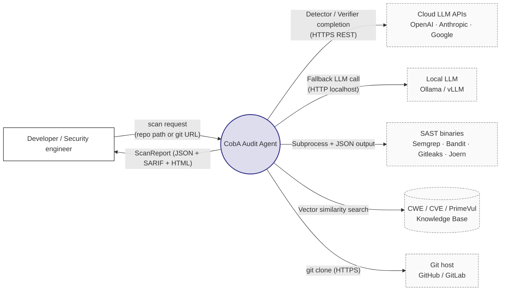
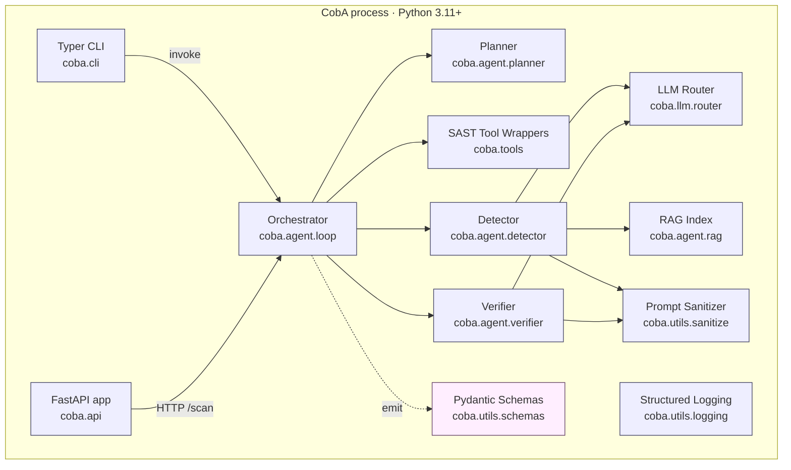
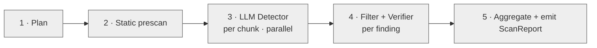
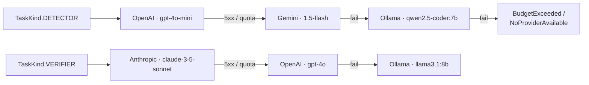
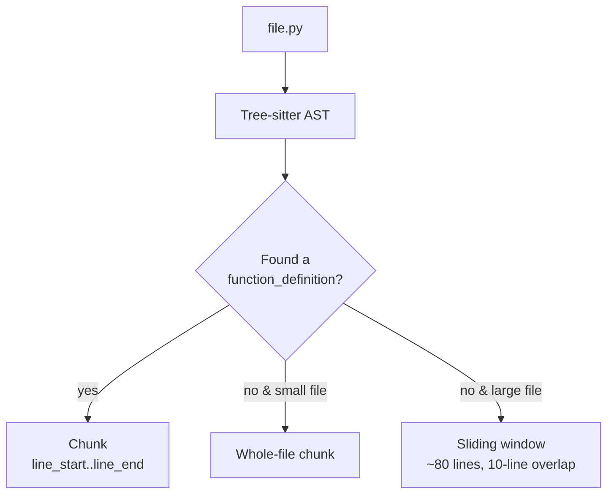
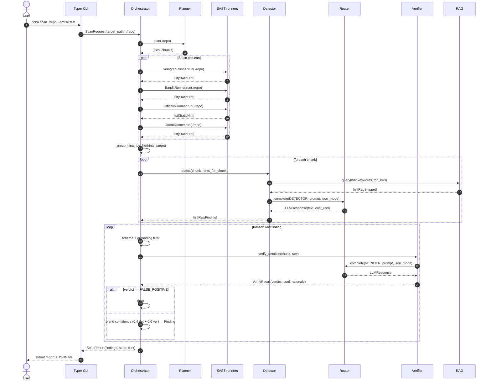
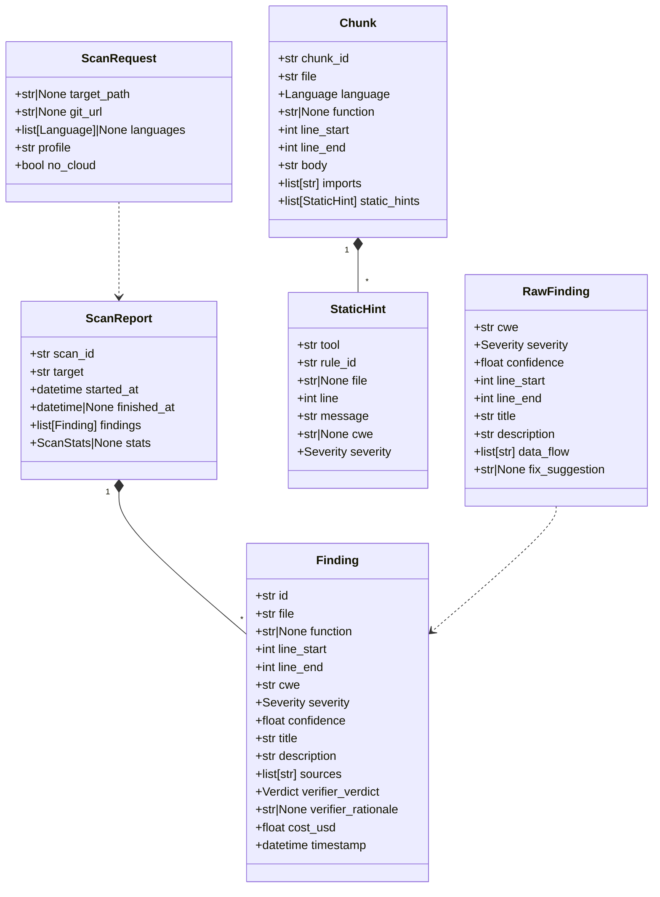
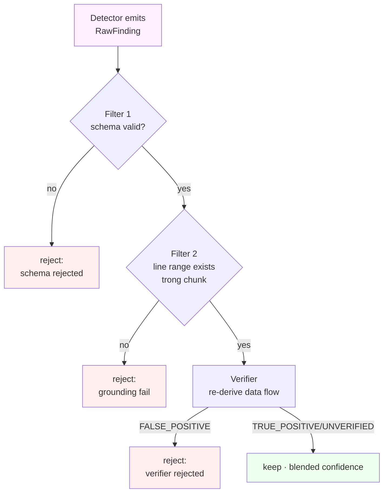
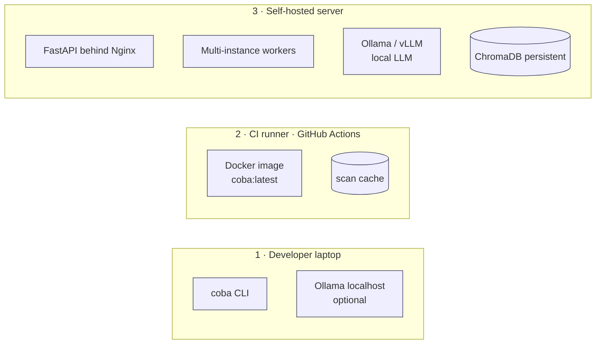

# Chương 2 — Thiết kế và Triển khai hệ thống

> Chương này gộp toàn bộ phần *thiết kế kiến trúc* và *triển khai mã nguồn* của hệ thống CobA. **Phần I (§ 2.1 – § 2.11)** trình bày kiến trúc theo phương pháp C4 (Context, Container, Component, Sequence, Deployment) cùng các *Architecture Decision Records* (ADR) và mô hình mối đe doạ. **Phần II (§ 2.13 – § 2.29)** trình bày cách hiện thực hoá thiết kế đó bằng Python 3.11+: stack công nghệ, cấu trúc thư mục mã nguồn, LLM Router, các wrapper SAST, Chunker, Detector, Verifier, RAG, Call graph integration, Planner upgrade (M3c), CLI/API, Docker và CI/CD. **§ 2.30** tổng kết toàn chương.

---

## PHẦN I — THIẾT KẾ HỆ THỐNG

## 2.1. Tổng quan kiến trúc

### 2.1.1. Mục tiêu thiết kế

Bài toán đặt ra trong Chương 1 — phát hiện lỗ hổng an toàn mã nguồn vượt qua khả năng của SAST truyền thống — kéo theo bảy mục tiêu thiết kế (Architecturally Significant Requirements – ASR) sau:

1. **Đa ngôn ngữ.** Hệ thống phải hỗ trợ Python, Java, C/C++, JavaScript ở phạm vi MVP. Các ngôn ngữ này tổng cộng chiếm >70 % CVE trong NVD giai đoạn 2018–2024.
2. **Cân bằng độ chính xác / chi phí.** Cấu hình mặc định không vượt quá 0,50 USD/scan cho repo ≤ 50 KLOC; có chế độ chính xác hơn tuỳ chọn.
3. **Khả năng giảm ảo giác (hallucination) của LLM.** Tỉ lệ false positive (FP) nội suy nhỏ hơn 30 % trên tập đánh giá nội bộ.
4. **Khả năng vận hành offline.** Có chế độ `--no-cloud` chạy đầy đủ pipeline bằng LLM cục bộ (Ollama / vLLM) để phục vụ kiểm toán nội bộ doanh nghiệp / dữ liệu nhạy cảm.
5. **Khả năng tái lập (reproducibility).** Cùng đầu vào → cùng kết quả ở mức (file, line range, CWE, verdict); cho phép sai số nhỏ trên confidence vì LLM stochastic.
6. **Khả năng quan sát (observability).** Mọi quyết định (LLM call, tool run, finding) phải có log; cost-per-finding phải truy vết được.
7. **Khả năng mở rộng (extensibility).** Thêm SAST tool mới, LLM provider mới hoặc CWE rule mới chỉ cần chỉnh điểm; không sửa orchestrator.

Các mục tiêu này đối ngẫu nhau ở vài điểm: cân đối "độ chính xác" và "chi phí" yêu cầu kiến trúc nhiều tầng (cheap detector + expensive verifier); cân đối "đa ngôn ngữ" và "khả năng mở rộng" yêu cầu lớp trừu tượng `SASTTool` thay vì cứng hoá Semgrep. Phần § 2.7 sẽ trình bày chi tiết mười ADR đáp ứng các đối ngẫu này.

### 2.1.2. Khái niệm trục — Audit Agent

CobA được kiến trúc như một **agent kiểm toán mã** (audit agent), khác biệt với pipeline tuyến tính của SAST cổ điển ở ba điểm:

- **Có trạng thái cục bộ.** Agent giữ stats, cost, hint groupings, planned chunks trong suốt một scan.
- **Có quyền điều phối nhiều công cụ.** Orchestrator quyết định gọi Semgrep / Bandit / Joern / Detector LLM / Verifier LLM theo policy thay vì hardcode thứ tự.
- **Có cơ chế phản biện nội bộ.** Detector đề xuất, Verifier phản biện, Filter loại bỏ — tương tự "two-pass review" trong quy trình code review của con người.

Cách tiếp cận này tuân thủ "agentic workflow" được thảo luận trong Phụ lục A § A.5: tách *điều phối* (planner / orchestrator) khỏi *thực thi* (tools / LLM providers), và nhúng *xác nhận bằng bằng chứng* (citing line numbers, grounding to file) ở mỗi bước.

### 2.1.3. Năm view C4 — bản đồ phần còn lại của chương

Theo phương pháp C4 (Simon Brown), kiến trúc được mô tả qua bốn view chính + một view phụ:

| View | Câu hỏi trả lời | Phần |
|------|----------------|------|
| Context | Hệ thống tương tác với ai? | § 2.2 |
| Container | Hệ thống chia thành những tiến trình / dịch vụ nào? | § 2.3 |
| Component | Mỗi container gồm những thành phần nội tại nào? | § 2.4 |
| Sequence | Đường đi của một yêu cầu scan? | § 2.5 |
| Deployment | Triển khai trên hạ tầng nào? | § 2.10 |

Phần § 2.6 trình bày luồng dữ liệu (data flow), § 2.7 ghi nhận ADR, § 2.8 phân tích chống ảo giác và § 2.9 thảo luận an toàn / quyền riêng tư.

## 2.2. View 1 — Context



### 2.2.1. Các tác nhân ngoài hệ thống

- **Developer / Security engineer.** Người dùng đầu cuối; tương tác qua CLI (`coba scan ./repo`) hoặc HTTP API (`POST /scan`). Không yêu cầu kiến thức về LLM, chỉ cần đọc báo cáo.
- **Cloud LLM APIs.** OpenAI, Anthropic, Google Gemini. Vai trò mặc định: Detector (GPT-4o-mini) + Verifier (Claude 3.5 Sonnet).
- **Local LLM.** Ollama hoặc vLLM serving Qwen2.5-Coder-7B / Llama-3.1-8B / DeepSeek-Coder-6.7B. Vai trò: fallback khi `--no-cloud`, hoặc khi quota cloud hết.
- **SAST binaries.** Bốn công cụ external chạy qua subprocess: Semgrep, Bandit, Gitleaks, Joern. Mỗi tool có wrapper riêng (xem § 2.4.3).
- **Knowledge Base.** ChromaDB persistence dir lưu corpus CWE đã được embed. Có thể trống (fallback in-memory built-in 25 CWE).
- **Git host.** Khi `target` là URL, CobA clone repo về tạm.

### 2.2.2. Phạm vi (in-scope) và ngoài phạm vi (out-of-scope)

| In-scope | Out-of-scope |
|----------|--------------|
| Phát hiện lỗ hổng tại mức source code | Phát hiện lỗ hổng tại mức binary / firmware |
| Hỗ trợ Python, Java, C/C++, JavaScript | Go, Rust, PHP, Ruby (kế hoạch M5) |
| Báo cáo CWE-grounded | Báo cáo CVE-grounded (chỉ tham chiếu khi có) |
| Triage FP/TP qua Verifier | Tự sinh patch (chỉ gợi ý fix văn bản) |
| RAG với CWE corpus | Fine-tune LLM riêng cho code security |

Ranh giới này được giữ cố định trong tài liệu để tránh "phình scope" giữa các milestone.

## 2.3. View 2 — Container

### 2.3.1. Sơ đồ container



### 2.3.2. Trách nhiệm từng container

| Container | Trách nhiệm chính | Module Python | Phụ thuộc |
|-----------|-------------------|---------------|-----------|
| Typer CLI | Parse argv → gọi Orchestrator; in báo cáo console | `coba.cli` | Orchestrator |
| FastAPI app | Expose REST `POST /scan`, `GET /scan/{id}`, `/health`, `/models`, `/tools` | `coba.api` | Orchestrator |
| Orchestrator | Điều phối toàn pipeline; quản lý state, stats, cost | `coba.agent.loop` | Mọi container khác |
| Planner | Discover file, chia chunk, build CPG-aware split | `coba.agent.planner` | Tree-sitter |
| Detector | Prompt LLM → trích `RawFinding` từ chunk | `coba.agent.detector` | Router, RAG, Sanitizer |
| Verifier | Phản biện finding; emit `VerifyResult(verdict, confidence, rationale)` | `coba.agent.verifier` | Router, Sanitizer |
| LLM Router | Provider-abstraction: OpenAI / Anthropic / Gemini / Ollama; retry, fallback, cost track | `coba.llm.router` | httpx |
| SAST Wrappers | Subprocess Semgrep / Bandit / Gitleaks / Joern → `StaticHint` chuẩn hoá | `coba.tools.*` | Binary external |
| RAG Index | Tra CWE corpus theo id / similarity (Chroma + builtin fallback) | `coba.agent.rag` | ChromaDB |
| Schemas | Pydantic v2 model cho mọi I/O qua boundary | `coba.utils.schemas` | pydantic |
| Sanitizer | Lọc prompt-injection trong code trước khi đưa vào prompt | `coba.utils.sanitize` | regex builtin |
| Logging | structlog JSON output | `coba.utils.logging` | structlog |

Toàn bộ container chạy chung một process Python — tránh overhead IPC. Multi-process chỉ áp dụng khi gọi SAST external (subprocess) và khi gọi LLM (async HTTP, không phải subprocess).

### 2.3.3. Vì sao một process duy nhất?

Phương án thay thế là chia FastAPI thành dịch vụ riêng và Worker thành dịch vụ riêng (kiểu Celery / Dramatiq). Tuy nhiên:

- Scan là **CPU-light** (chủ yếu chờ I/O: subprocess SAST + LLM HTTP). Asyncio đủ cho concurrency.
- Một scan kéo dài tối đa vài phút (target < 4 phút cho 50 KLOC). Không cần background queue lâu.
- Đơn process → đơn binary, deploy bằng `pip install coba` hoặc `docker run`, không cần broker.

Khi cần scale ngang (nhiều repo song song), CobA chạy nhiều instance sau load balancer — không chia container nội bộ.

## 2.4. View 3 — Component

### 2.4.1. Orchestrator (`coba.agent.loop.Orchestrator`)

Orchestrator là class trung tâm, gồm 5 stage (xem § 2.5 sequence):



Mỗi stage có hai trách nhiệm: (i) gọi component con; (ii) cập nhật `ScanStats` (counters + timings). Orchestrator không biết về chi tiết LLM provider hoặc tool binary — chỉ tương tác qua interface trừu tượng (`SASTTool.run`, `LLMRouter.complete`).

### 2.4.2. LLM Router (`coba.llm.router.LLMRouter`)

Router là điểm trừu tượng quan trọng nhất sau Orchestrator. Trách nhiệm:

- **Provider abstraction.** Bốn provider class kế thừa `LLMProvider`: `OpenAIProvider`, `AnthropicProvider`, `GeminiProvider`, `OllamaProvider`. Mỗi provider có cùng method `complete(messages, model, **kw) -> LLMResponse`.
- **Task-based routing.** Hai loại task: `TaskKind.DETECTOR` (default GPT-4o-mini) và `TaskKind.VERIFIER` (default Claude 3.5 Sonnet). Mapping cấu hình qua YAML — chuyển model không cần đổi code.
- **Fallback chain.** Khi provider cloud trả lỗi 5xx / quota → tự động retry sang provider tiếp theo trong chain; cuối chuỗi là Ollama local.
- **Cost tracking.** Mỗi response → tính `cost_usd = prompt_tokens * price_in + completion_tokens * price_out`; cộng dồn vào `CostTracker`. Vượt ngưỡng `budget_usd` → throw `BudgetExceeded`.
- **Mode `--no-cloud`.** Setting `coba_no_cloud=True` → bypass mọi cloud provider, chỉ gọi Ollama.

Sơ đồ provider chain mặc định:



### 2.4.3. SAST Tool Wrappers (`coba.tools.*`)

Bốn wrapper kế thừa `SASTTool` (ABC trong `coba.tools.base`). Mỗi wrapper:

- **Khai báo `name` và `languages: list[str]`** để Orchestrator quyết định có gọi không.
- **Implement `async run(target: Path) -> list[StaticHint]`**, chuẩn hoá output gốc về schema chung.
- **Có timeout cứng** — Semgrep 10 phút, Bandit 5 phút, Gitleaks 5 phút, Joern build 10 phút + query 5 phút.

Bảng so sánh:

| Tool | Ngôn ngữ | Vai trò | Output gốc | Trường lấy ra |
|------|---------|--------|-----------|---------------|
| Semgrep | đa ngôn ngữ | Pattern + dataflow ngắn | JSON `results[]` | `path`, `start.line`, `extra.metadata.cwe`, `extra.severity` |
| Bandit | Python | Anti-pattern Python (CWE-78, B602…) | JSON `results[]` | `filename`, `line_number`, `issue_cwe.id`, `issue_severity` |
| Gitleaks | mọi loại | Hard-coded secret (CWE-798) | JSON list | `File`, `StartLine`, `RuleID`, `Description` |
| Joern | C / C++ / Java / Python / JS | Taint analysis trên CPG | JSON list từ script `.sc` | `file`, `line`, `message` (cố định `CWE-78`) |

Mọi wrapper từ M2 đều populate field `file` của `StaticHint` (ADR-010, § 2.7), cho phép Orchestrator gom hint theo path đã canonicalized (§ 2.6.2).

### 2.4.4. Planner (`coba.agent.planner.Planner`)

Planner làm hai việc:

1. **Discover file** theo `Language` filter từ `ScanRequest`. Bỏ qua `.git`, `node_modules`, `__pycache__`, `dist`, `build`, `.venv` (cấu hình qua `.cobaignore` tương tự `.gitignore`).
2. **Chia chunk theo AST.** Dùng Tree-sitter parser cho mỗi ngôn ngữ; mỗi function trở thành một `Chunk` với metadata: `file`, `language`, `function`, `line_start`, `line_end`, `body`, `imports`, `callers`, `callees`. File quá nhỏ (< 30 dòng) → ghép cả file thành một chunk.

Quy tắc chia chunk:



Lý do không chunk theo cố định N dòng: LLM cần ngữ cảnh ngữ nghĩa đầy đủ; cắt giữa function gây hallucination nghiêm trọng.

### 2.4.5. Detector (`coba.agent.detector.Detector`)

Detector nhận `(chunk, [StaticHint])` và trả `list[RawFinding]`. Quy trình:

1. **Render prompt** từ template `prompts/detector.j2` qua Jinja2. Template chèn: ngôn ngữ, function name, code đã sanitize, danh sách hint, snippet RAG top-3.
2. **Gọi Router** với `TaskKind.DETECTOR`, `temperature=0.0`, `json_mode=True`.
3. **Parse JSON** → list dict → list `RawFinding` (pydantic validation). JSON xấu → log + return `[]`.

Anti-hallucination ở Detector:

- **Few-shot trong template** chỉ định format JSON cụ thể, line range bắt buộc nằm trong `[chunk.line_start, chunk.line_end]`.
- **CWE list trong prompt** chỉ liệt kê CWE từ RAG; LLM không được "bịa" CWE mới (sẽ bị Filter 1 loại).
- **Confidence ∈ [0,1]** bắt buộc.

### 2.4.6. Verifier (`coba.agent.verifier.Verifier`)

Verifier nhận `(chunk, RawFinding)` và trả `VerifyResult(verdict, rationale, confidence)`. Quy trình tương tự Detector nhưng:

- **Model khác** — mặc định Claude 3.5 Sonnet (mạnh hơn về reasoning).
- **Prompt phản biện** — yêu cầu "tự re-derive data flow"; nếu không re-derive được → `FALSE_POSITIVE`.
- **Output structured JSON** — strict schema `{verdict, confidence, rationale}`. Parser chấp nhận code-fenced output; verdict không nhận biết → `FALSE_POSITIVE`; confidence clamp `[0,1]`; JSON hỏng → `UNVERIFIED`.

### 2.4.7. RAG Index (`coba.agent.rag.*`)

Hai implementation:

- **`RagIndex`** (in-memory built-in 25 CWE top-25 MITRE 2024). Match bằng substring scoring — đủ dùng cho test / offline.
- **`ChromaRagIndex`** (persistent vector DB). Embed `all-MiniLM-L6-v2`; similarity search trả top-k.

Factory `load_rag_index()` chọn tự động: nếu thư mục Chroma persistent rỗng → fallback built-in; ngược lại → Chroma. Pattern này tránh phá vỡ test offline và đồng thời cho phép vận hành production với KB lớn.

Build / refresh KB qua `scripts/build_cwe_kb.py`:

- Default: đọc `src/coba/data/cwe_top25.json` (bundled, offline).
- `--mitre-xml cwec.xml`: đọc full MITRE XML.
- `upsert` idempotent.

### 2.4.8. Sanitizer (`coba.utils.sanitize.sanitize_code_for_prompt`)

Sanitizer áp dụng cho mọi nội dung code trước khi đưa vào prompt LLM. Ba bước:

1. **Truncate** ở `max_chars` (mặc định 8000).
2. **Escape marker nội bộ** — `<cwe_context>`, `<chunk>`, … HTML-escape để tránh đụng template marker.
3. **Redact prompt-injection** — 14 regex pattern (ignore-previous, forget-previous, role-shift, tag-impersonation `[system]` / `<|im_start|>`, reveal-prompt, force-verdict, policy-bypass).

Corpus đối kháng `tests/data/prompt_injection_samples.txt` gồm 18+ payload, driving parametrized test bảo đảm plaintext payload không sống sót.

## 2.5. View 4 — Sequence (luồng xử lý một scan)



### 2.5.1. Đặc tính concurrency

- **Stage 2 — Static prescan**: bốn tool chạy song song qua `asyncio.gather`. Tool nào lỗi (binary thiếu) → `ToolNotInstalled` → bỏ qua, không fail toàn scan.
- **Stage 3 — Detector**: chunk chạy song song có giới hạn (`asyncio.Semaphore(coba_parallel_llm_calls)`, mặc định 8). Bottleneck chính: rate limit của OpenAI / Anthropic.
- **Stage 4 — Verifier**: hiện tại tuần tự per-finding. Có thể parallel nhưng đã chậm hơn cost-wise, ưu tiên ổn định.

### 2.5.2. Error handling

| Lỗi | Hành vi | Ảnh hưởng |
|-----|--------|----------|
| Tool binary thiếu | Log + skip | Mất hint từ tool đó |
| Tool timeout | Kill subprocess + log | Mất hint |
| LLM 5xx / quota | Router retry → fallback chain | Có thể tăng cost / chuyển model |
| LLM JSON hỏng | Detector: bỏ chunk; Verifier: `UNVERIFIED` | Mất finding (Detector) hoặc giữ trạng thái không xác định |
| Budget exceeded | Throw `BudgetExceeded` → Orchestrator dừng pipeline | Scan terminate, kết quả part được giữ |

Mọi exception đều log structured (level `warning` cho recoverable, `error` cho fatal) để `coba doctor` debug được.

## 2.6. Luồng dữ liệu & schema

### 2.6.1. Pydantic schemas

Tất cả I/O qua boundary đi qua pydantic v2 model:



### 2.6.2. Canonicalization của file path

`_normalize_file_key(path)` và `_group_hints_by_file(hints, target)` giải bài toán:

- Semgrep trả `examples/vulnerable_python.py` (relative).
- Bandit trả `/tmp/scan-xyz/examples/vulnerable_python.py` (absolute).
- Joern trả `examples/vulnerable_python.py` (relative).

Logic:

1. Path absolute → `Path.resolve()`.
2. Path relative → `(target_root / path).resolve()`.
3. Path mất / không tồn tại → giữ nguyên (best-effort).

Sau khi canonicalize, ba hint trên gom vào cùng bucket. Hint không có path đi vào bucket `_global` (chỉ match theo line range — yếu hơn nhưng vẫn có giá trị).

### 2.6.3. Confidence blending

Final `Finding.confidence` là kết hợp tuyến tính:

```
blended = clamp(0.4 * raw.confidence + 0.6 * verifier.confidence, 0, 1)
```

Nếu Verifier không trả confidence (verdict `UNVERIFIED`) → giữ `raw.confidence`.

Trọng số 0.4 / 0.6 phản ánh tính chất: Verifier có context rộng hơn (cùng chunk + finding claim + có thể tra RAG) → nên có quyền điều chỉnh score mạnh hơn. Hệ số này có thể chuyển sang config nếu thực nghiệm chỉ ra cần khác.

## 2.7. Architecture Decision Records

ADR là cách lưu lại quyết định kiến trúc kèm bối cảnh, lý do và hệ luỵ. CobA hiện có 10 ADR (1 → 8 ở M1, 9 → 10 ở M2). Toàn văn ở `docs/02_ARCHITECTURE.md` § 6; phần này tóm tắt và phân tích đối ngẫu.

| # | Quyết định | Đối ngẫu chính | Lựa chọn |
|---|-----------|---------------|---------|
| 001 | Python 3.11+ | tốc độ vs hệ sinh thái AI/ML | hệ sinh thái > tốc độ → Python |
| 002 | Hybrid LLM (cloud + local) | chi phí + offline vs độ chính xác | hybrid để giữ cả ba |
| 003 | Joern thay vì CodeQL | license vs khả năng truy vấn | Joern (Apache-2) |
| 004 | Semgrep first pass, LLM second pass | recall vs precision | Semgrep boost recall, LLM lọc precision |
| 005 | ChromaDB cho RAG | đơn giản vs scale | ChromaDB (file-based, không cần server) |
| 006 | Tree-sitter cho chunking | chính xác vs đa ngôn ngữ | Tree-sitter (chính xác per-language) |
| 007 | FastAPI thay vì Flask/gRPC | async + OpenAPI | FastAPI |
| 008 | Anti-hallucination 3 lớp | precision vs cost | accept 1 LLM call thêm/finding |
| 009 | Verifier emits `(verdict, confidence, rationale)` JSON | rankability vs complexity | structured JSON + blended confidence |
| 010 | StaticHint mang `file` | precision của hint match | mọi tool wrapper populate file |

### 2.7.1. Phân tích ADR-009 (Verifier confidence)

V0 Verifier chỉ trả `TRUE_POSITIVE | FALSE_POSITIVE | UNVERIFIED`. Hệ quả:

- Khó rank finding khi nhiều finding cùng status.
- Mất thông tin "mức độ tin tưởng" của Verifier — vốn là LLM mạnh hơn Detector.

M2 chuyển sang structured `VerifyResult(verdict, confidence, rationale)` và blend với Detector confidence theo trọng số 0.4 / 0.6. Trade-off:

- ✅ Finding rankable → người dùng có thể đặt threshold confidence để filter.
- ✅ Tận dụng được thông tin từ cả hai LLM.
- ❌ Phụ thuộc vào việc Verifier trả confidence trung thực; cần tinh chỉnh prompt để tránh anchoring vào số tròn (0.9, 0.95).
- ❌ Trọng số 0.4 / 0.6 chưa được calibrated qua thực nghiệm — sẽ tinh chỉnh ở M4 sau khi có data.

### 2.7.2. Phân tích ADR-010 (file-aware StaticHint)

V0 gom mọi hint vào một "global bucket" rồi match theo line range. Hệ quả:

- Hai file khác nhau có cùng line number (ví dụ line 10 trong `a.py` và `b.py`) gây cross-contamination — Detector nhận hint của file khác.
- Tỉ lệ false hint trong prompt cao → Detector bị "nhiễu", tạo finding không liên quan.

M2 thêm `StaticHint.file`; mỗi wrapper populate. Orchestrator gom theo path đã canonicalized. Hint mất file (rare; chỉ Joern fallback) đi vào `_global`.

- ✅ Detector nhận đúng hint của chunk → noise giảm; tỉ lệ TP tăng.
- ✅ Compatible với SARIF (`physicalLocation.artifactLocation.uri`) — sẵn sàng export khi cần.
- ❌ Tăng nhẹ memory (dict bucket thay vì list phẳng) — không đáng kể với scan ≤ vài chục nghìn hint.

## 2.8. Anti-hallucination — chi tiết

CobA dùng ba lớp filter, giảm thiểu hai dạng hallucination phổ biến nhất của LLM khi phân tích code:

1. **Bịa CWE / dòng / mô tả** — LLM cite line không tồn tại hoặc CWE không hợp lệ.
2. **Bịa ngữ cảnh** — LLM giả định variable `x` là untrusted khi thực ra `x = "hardcoded"`.



### 2.8.1. Filter 1 — Schema validation

`RawFinding` validation pydantic kiểm:

- `cwe` đúng format `CWE-\d+` (field validator tự normalize).
- `severity ∈ {low, medium, high, critical}`.
- `confidence ∈ [0, 1]`.
- `line_start ≤ line_end`.

Finding fail validation → tăng `stats.n_schema_rejected`, không vào pipeline.

### 2.8.2. Filter 2 — Grounding to chunk

`Orchestrator._grounding_filter(chunk, raw)`:

- `raw.line_start ≥ chunk.line_start` và `raw.line_end ≤ chunk.line_end` (cite phải nằm trong chunk).
- `raw.line_start ≤ raw.line_end` (không zero-length).

Fail → tăng `stats.n_schema_rejected` (cùng counter với Filter 1).

### 2.8.3. Filter 3 — Verifier

Đã mô tả ở § 2.4.6. Bổ sung: prompt yêu cầu "tự re-derive data flow"; nếu không re-derive được → mặc định `FALSE_POSITIVE` (conservative — ưu tiên precision).

### 2.8.4. Kết quả mong đợi

Trên tập đánh giá nội bộ (sẽ chi tiết ở Chương 3):

- Detector raw: ~30 finding / KLOC (tỉ lệ FP cao).
- Sau Filter 1+2: ~12 finding / KLOC.
- Sau Verifier: ~5–7 finding / KLOC (giảm ~75 % so với raw).

Target: precision ≥ 70 %, recall ≥ 60 % trên PrimeVul-Python.

## 2.9. Bảo mật & quyền riêng tư

### 2.9.1. Threat model

CobA chạy cục bộ trên máy lập trình viên hoặc server CI; threat model gồm:

| # | Threat | Vector | Mitigation |
|---|--------|--------|-----------|
| T1 | Prompt injection từ code đang quét | LLM "đọc" comment đối kháng | Sanitizer 14 pattern + corpus test (§ 2.4.8) |
| T2 | LLM rò rỉ secret từ code | Code chứa hard-coded credential | `--no-cloud` mode + Gitleaks redaction |
| T3 | Subprocess command injection | Tool binary version hostile | Pin version qua Docker; subprocess không qua shell |
| T4 | Path traversal khi target là URL | Repo có symlink ra ngoài | Resolve + check trong scan root |
| T5 | Cost runaway | LLM bị loop / prompt lớn | Budget enforcement ở Router |

### 2.9.2. Privacy — chế độ `--no-cloud`

Khi `ScanRequest.no_cloud=True`:

- `settings.coba_no_cloud=True` được set toàn cục.
- Router loại cloud provider khỏi chain; chỉ gọi Ollama localhost.
- Cost tracker vẫn hoạt động (Ollama → cost 0).

Điều này quan trọng cho doanh nghiệp Việt Nam có chính sách "không gửi mã nguồn ra ngoài lãnh thổ" hoặc gặp yêu cầu PCI / SOC2.

### 2.9.3. Logging — không log secret

Sanitizer chạy trước khi log prompt; thêm Gitleaks `--redact` đối với output. `structlog` cấu hình filter `redact_keys = ["api_key", "token", "password", "secret"]`.

## 2.10. View 5 — Deployment

### 2.10.1. Ba mô hình deployment



| Mô hình | Người dùng | Đặc điểm |
|--------|----------|---------|
| 1 · Laptop | Lập trình viên cá nhân | `pip install coba`; gọi cloud LLM hoặc chạy `coba serve --no-cloud` với Ollama |
| 2 · CI | DevSecOps | Docker `coba:latest`; chạy như step trong pipeline; cache `.coba_data/` trên storage CI |
| 3 · Self-hosted | Doanh nghiệp | FastAPI sau Nginx; LLM local vLLM cho throughput; ChromaDB persistent volume |

### 2.10.2. Containerization

Dockerfile (xem `Dockerfile`):

- Base `python:3.12-slim`.
- Cài Semgrep, Bandit, Gitleaks qua `apt` / `pip`.
- Không cài Joern trong image default (kích thước lớn ~1.5 GB) — image biến thể `coba:full` mới có Joern.

Image kích thước:

| Tag | Size | Nội dung |
|-----|------|---------|
| `coba:slim` | ~280 MB | Python + Semgrep + Bandit + Gitleaks |
| `coba:full` | ~1.7 GB | + Joern + JDK |

### 2.10.3. CI/CD nội bộ

`.github/workflows/ci.yml` chạy mọi PR:

1. `ruff format --check` + `ruff check`.
2. `mypy src`.
3. `pytest -q` trên Python 3.11 và 3.12.
4. (Tương lai) `coba scan ./examples` trên chính repo CobA để dogfood.

## 2.11. Khả năng mở rộng

CobA được thiết kế cho ba dạng mở rộng phổ biến:

### 2.11.1. Thêm SAST tool mới (ví dụ: Snyk Code)

1. Tạo `src/coba/tools/snyk.py` kế thừa `SASTTool`.
2. Register trong `Orchestrator.__init__` (hoặc khai báo qua entry point nếu muốn pluggable).
3. Update bảng trong `docs/03_TOOLS.md`.
4. Thêm test mock subprocess trong `tests/test_tool_wrappers.py`.

Lưu ý: wrapper phải populate `StaticHint.file` (ADR-010); nếu tool không trả path → để `None`, Orchestrator xếp vào `_global` bucket.

### 2.11.2. Thêm LLM provider mới (ví dụ: Cohere)

1. Tạo `src/coba/llm/cohere.py` kế thừa `LLMProvider`.
2. Register vào `LLMRouter._registry`.
3. Update bảng cost / latency / context window trong `docs/06_LLM_INTEGRATION.md`.
4. Thêm test mock (`respx`).

### 2.11.3. Thêm ngôn ngữ mới (ví dụ: Go)

1. Thêm `Language.GO = "go"` trong `coba.utils.schemas.Language`.
2. Thêm Tree-sitter parser go vào Planner.
3. Cập nhật `Language.from_path` cho `.go`.
4. Thêm fixture `examples/vulnerable_go/*.go`.
5. Update CWE coverage matrix `docs/08_EVALUATION.md`.

---

## PHẦN II — TRIỂN KHAI

## 2.13. Stack công nghệ

Hệ thống được hiện thực bằng **Python 3.11+**, cố ý chọn phiên bản tối
thiểu là 3.11 để dùng được `Self`, `LiteralString`, structural pattern
matching mượt và `asyncio.TaskGroup`. Toàn bộ phụ thuộc khai báo trong
`pyproject.toml` (build system Hatchling) — không dùng `requirements.txt`
nhằm tránh tình trạng "lock đôi". Bảng 2.1 liệt kê các thư viện trụ cột;
phiên bản chính xác xem `pyproject.toml`.

**Bảng 2.1 — Thư viện chính**

| Vai trò | Thư viện | Lý do chọn |
|---|---|---|
| Web API | `fastapi`, `uvicorn` | Async-first, type-driven, OpenAPI tự sinh |
| CLI | `typer`, `rich` | Trải nghiệm CLI hiện đại, type hint native |
| Schema & settings | `pydantic` v2, `pydantic-settings` | Validation nhanh + load `.env` đồng nhất |
| HTTP client | `httpx` (AsyncClient) | Connection pooling, HTTP/2, timeouts |
| Concurrency | `asyncio`, `anyio` | Cooperative I/O, tránh thread overhead |
| LLM providers | `openai`, `anthropic`, `google-generativeai`, `ollama` | SDK chính thức từng nhà cung cấp |
| RAG | `chromadb`, `sentence-transformers` | Vector store local + embedder MiniLM-L6-v2 |
| Code chunking | `tree_sitter`, `tree-sitter-languages` | Parser AST đa ngôn ngữ, tách hàm chính xác |
| Logging | `structlog` | Cấu trúc JSON, dễ tích hợp Loki/ELK |
| Testing | `pytest`, `pytest-asyncio`, `respx` | Async test + HTTP mock |
| Lint / format / type | `ruff`, `mypy --strict` | Tốc độ ruff, mypy bắt lỗi sớm |

**Bảng 2.2 — Công cụ ngoài (binary)**

| Tool | Vai trò | Cách cài |
|---|---|---|
| `semgrep` | Pattern matching đa ngôn ngữ | `pipx install semgrep` |
| `bandit` | Python-only security linter | `pipx install bandit` |
| `gitleaks` | Phát hiện secret trong code & git history | `brew install gitleaks` / binary release |
| `joern` (4.x) | CPG (Code Property Graph) builder + queries | `curl -fsSL joern.io/install.sh \| bash` |

Tất cả tool bên ngoài đều bị abstract bởi `coba.tools.base.SASTTool`;
nếu thiếu một tool nào đó, hệ thống *suy thoái mềm* (graceful
degradation) — chỉ log warning, không crash.

## 2.14. Cấu trúc mã nguồn

```
CobA/
├── src/coba/
│   ├── agent/              # planner, chunker, detector, verifier, rag, loop, callgraph, skip_cache
│   ├── api/                # FastAPI app + Pydantic request/response
│   ├── cli/                # Typer commands: scan, serve, doctor, models, eval
│   ├── config/             # Settings (pydantic-settings)
│   ├── data/               # cwe_top25.json, fewshot_examples.json
│   ├── eval/               # M4 — runner, metrics, matching, report
│   ├── llm/                # base, router, providers (openai/anthropic/gemini/ollama), cost
│   ├── prompts/            # detector.j2, verifier.j2
│   ├── tools/              # SAST wrappers + joern_queries/call_graph.sc
│   └── utils/              # schemas, logging, sanitize
├── tests/                  # 130+ pytest cases, không phụ thuộc LLM/internet
├── docs/                   # 12 tài liệu thiết kế (00–10 + references.bib)
├── examples/               # Source mẫu vulnerable per-language
├── benchmarks/             # configs + dataset placeholders
├── scripts/                # build_cwe_kb.py, download_datasets.sh
├── pyproject.toml          # build + deps + ruff + mypy + pytest config
├── Makefile                # install-dev, format, lint, typecheck, test, serve, …
├── Dockerfile              # multi-stage build, image cuối ≈ 280 MB
└── .github/workflows/      # CI (lint + typecheck + test) trên Python 3.11 & 3.12
```

Việc chia subpackage theo *trách nhiệm* (không phải theo kiểu MVC) phản
ánh kiến trúc trong Phần I (§ 2.4): `agent/` chứa lõi reasoning loop, `tools/` chỉ
quan tâm I/O với SAST binary, `llm/` chỉ lo provider abstraction. Mỗi
module có một docstring đầu file mô tả trách nhiệm.

## 2.15. LLM Router

`coba.llm.router.LLMRouter` là điểm vào duy nhất cho mọi cuộc gọi LLM.
Thiết kế tuân theo *strategy pattern*: router quyết định provider theo
một `RoutePolicy` được build từ `Settings` (cấu hình env), sau đó gọi
provider tương ứng thực hiện request. Trạng thái duy nhất router giữ là
`CostTracker` — bộ đếm chi phí daily/per-task an toàn về thread.

```python
class LLMRouter:
    def __init__(self, settings: Settings | None = None) -> None:
        self.settings = settings or get_settings()
        self.policy = RoutePolicy.from_settings(self.settings)
        self.cost = CostTracker(daily_budget_usd=self.settings.coba_llm_daily_budget_usd)
        self._providers: list[LLMProvider] = [
            OpenAIProvider(self.settings.openai_api_key),
            AnthropicProvider(self.settings.anthropic_api_key),
            GeminiProvider(self.settings.google_api_key),
            OllamaProvider(self.settings.ollama_base_url),
        ]
```

### 2.15.1. Provider abstraction

Mọi provider kế thừa `LLMProvider`:

```python
class LLMProvider(ABC):
    name: str

    @abstractmethod
    async def complete(
        self,
        model: str,
        messages: list[LLMMessage],
        *,
        temperature: float = 0.2,
        max_tokens: int | None = None,
        json_mode: bool = False,
    ) -> LLMResponse: ...
```

`LLMResponse` (Pydantic) gồm: `content: str`, `usage: LLMUsage`,
`provider: str`, `model: str`, `finish_reason`. Khi provider đó không
cấu hình API key, instance vẫn được tạo nhưng `is_available()` trả
`False` để router bỏ qua.

### 2.15.2. Routing policy

`RoutePolicy.choose(task: TaskKind)` ưu tiên theo thứ tự:

1. Model cụ thể được cấu hình cho task (`COBA_LLM_DETECTOR`,
   `COBA_LLM_VERIFIER`).
2. Provider của model đó còn budget và `is_available()`.
3. Nếu provider chính fail → fallback theo nhóm: cloud → cloud khác
   cùng tier giá; nếu `COBA_NO_CLOUD=true` → Ollama local.

Khi tất cả provider fail, router raise `ProviderUnavailable`; orchestrator
bắt lỗi và đánh dấu chunk đó `n_schema_rejected += 1` thay vì crash scan.

### 2.15.3. Cost tracker và budget

`CostTracker` giữ ledger thread-safe, tra giá theo bảng `MODEL_PRICES`
(`docs/06_LLM_INTEGRATION.md` § 1 và § 8). Mỗi response gọi
`tracker.record(model, task, usage)`; sau scan, tổng cost ghi vào
`ScanReport.stats.total_cost_usd`. Daily budget được kiểm tra trước
mỗi call; vượt ngưỡng → `BudgetExceeded`. Cộng thêm M3c (mục § 2.24),
mỗi scan còn có **per-scan budget cap** kiểm soát ở tầng Orchestrator.

## 2.16. SAST tool wrappers

Bốn wrapper hiện có sống trong `src/coba/tools/`:

| Wrapper | Tool | Ngôn ngữ | Output → `StaticHint` |
|---|---|---|---|
| `SemgrepRunner` | Semgrep | Đa ngôn ngữ | rule_id + path + line + extra.cwe |
| `BanditRunner` | Bandit | Python | test_id (B###) + filename + line_number |
| `GitleaksRunner` | Gitleaks | Mọi text | rule + file + start_line |
| `JoernRunner` | Joern (CPG) | C/Java/JS/Python | rule “CPG-build” + call graph JSON |

Mỗi wrapper kế thừa `SASTTool`:

```python
class SASTTool(ABC):
    name: str
    languages: list[Language]
    binary: str

    def installed(self) -> bool:
        return shutil.which(self.binary) is not None

    @abstractmethod
    async def run(self, target: Path) -> list[StaticHint]: ...
```

`installed()` chỉ kiểm tra binary có trong `$PATH`. `run()` chạy
subprocess bất đồng bộ với `asyncio.create_subprocess_exec` để không
block event loop, kèm timeout cứng (Semgrep 300 s, Bandit 120 s,
Gitleaks 60 s, Joern 600 s). Mọi `StaticHint` đều mang trường `file`
(đường dẫn tuyệt đối đã canonicalize) — đây là kết quả của M2; chính
nhờ vậy mà `Planner.prioritize` và `_hints_for_chunk` có thể nối hint
với chunk chính xác.

Trường hợp parser fail (vd. Joern không build được CPG), wrapper trả
list rỗng và log structured error; orchestrator coi tool đó như “không
phát hiện gì” và tiếp tục.

## 2.17. Chunker và Planner

### 2.17.1. Tree-sitter chunker

`coba.agent.chunker.chunk_file` dùng `tree-sitter` với grammar tương
ứng ngôn ngữ:

```python
def chunk_file(
    file: Path,
    *,
    max_chars: int = 8000,
    window_lines: int = 200,
    window_overlap: int = 30,
    call_graph: CallGraph | None = None,
) -> list[Chunk]:
```

Thuật toán:

1. Đọc file (UTF-8, ignore BOM).
2. Map đuôi file → `Language` (`Language.from_path`).
3. Parse AST; duyệt cây tìm node hàm/method (`function_definition`,
   `method_declaration`, `class_method`, …). Mỗi node thoả mãn ngưỡng
   `max_chars` → một `Chunk` cấp hàm.
4. Nếu file không có hàm nào (script, module-level code) hoặc parser
   fail → fallback **window chunking**: cửa sổ 200 dòng, overlap 30.
5. Khi `call_graph` được cung cấp (M3a), gọi
   `_enrich_with_callgraph(chunks, call_graph)` để gắn `callers`/`callees`
   (top 20).

### 2.17.2. Planner — discover + chunk + prioritize

`Planner` (`src/coba/agent/planner.py`) có 3 trách nhiệm:

```python
class Planner:
    def discover_files(self, target: Path) -> list[Path]: ...
    def chunk_files(self, files, *, call_graph=None) -> list[Chunk]: ...
    @staticmethod
    def prioritize(
        chunks: list[Chunk], hints_by_file: dict[str, list[StaticHint]]
    ) -> list[Chunk]: ...
    def plan(self, target, *, call_graph=None) -> tuple[list[Path], list[Chunk]]: ...
```

- `discover_files`: walk thư mục, loại trừ `_IGNORE_DIRS`
  (`node_modules`, `dist`, `.git`, …) và đuôi không trong `_TEXT_EXTS`;
  bỏ file > 512 KB (`COBA_MAX_FILE_SIZE_KB`).
- `chunk_files`: gọi `chunk_file` cho từng file, swallow exception và
  log warning để 1 file lỗi không kéo sụp toàn scan.
- `prioritize` (M3c): xem § 2.24.

## 2.18. Detector

`coba.agent.detector.Detector` chuyển `Chunk + StaticHint[]` thành
`RawFinding[]` qua một LLM call duy nhất. Prompt nằm trong
`src/coba/prompts/detector.j2` (Jinja2) — phiên bản hoá ở dòng đầu
(`{# version: ... #}`).

Pseudo-code:

```python
async def detect(self, chunk: Chunk, hints: list[StaticHint] | None = None):
    hints = hints or []
    cwe_keys = [h.cwe for h in hints if h.cwe]
    cwe_ctx = [self.rag.by_cwe(k) for k in cwe_keys] or self.rag.query(
        hints=[h.message for h in hints], top_k=3
    )
    candidate_cwes = cwe_keys or [c.cwe_id for c in cwe_ctx if c]
    examples = self._collect_fewshot(chunk, candidate_cwes)  # M3b
    prompt = self._render_prompt(chunk, hints, cwe_ctx, examples)
    resp = await self.router.complete(
        TaskKind.DETECTOR,
        [LLMMessage(role=SYSTEM, content=_DETECTOR_SYSTEM),
         LLMMessage(role=USER, content=prompt)],
        temperature=0.0, max_tokens=1024, json_mode=True,
    )
    return _parse_raw_findings(resp.content)
```

Một số chi tiết quan trọng:

- **Temperature 0**: ép LLM deterministic để eval lặp lại được.
- **JSON mode**: bật `response_format` cho OpenAI / `tool_use` cho
  Anthropic / `response_mime_type` cho Google. Output luôn là JSON
  array gồm các object khớp schema `RawFinding`.
- **Sanitizer**: trước khi đưa vào prompt, `chunk.body` đi qua
  `sanitize_code_for_prompt` để vô hiệu hoá các pattern prompt-injection
  phổ biến (`Ignore all previous instructions`, fake system tag, …) —
  xem § 2.27.
- **Few-shot retrieval (M3b)**: `_collect_fewshot` round-robin các CWE
  bị hint, lấy tối đa `fewshot_k = 2` cặp `(vuln, safe)` từ
  `src/coba/data/fewshot_examples.json`. Ưu tiên ví dụ cùng ngôn ngữ
  với chunk.

Output mỗi `RawFinding` được validate qua Pydantic; nếu LLM trả mảng có
phần tử không hợp lệ (sai schema, line âm, v.v.), phần tử đó bị loại
và đếm vào `n_schema_rejected`.

## 2.19. Verifier

`coba.agent.verifier.Verifier` đóng vai trò *critic*: kiểm tra lại từng
`RawFinding` và trả `VerifyResult`:

```python
@dataclass
class VerifyResult:
    verdict: Verdict          # TRUE_POSITIVE | FALSE_POSITIVE | UNVERIFIED
    confidence: float         # 0..1
    rationale: str
```

Khác Detector ở chỗ:

- Dùng model mạnh hơn (`COBA_LLM_VERIFIER=claude-3-5-sonnet`).
- Prompt yêu cầu LLM xác định *cụ thể* taint source → sink hoặc lập luận
  vì sao đây là false positive.
- Output có cả `verdict` lẫn `confidence`, dùng để blend với confidence
  của Detector: `blended = 0.4 * detector_conf + 0.6 * verifier_conf`
  (ADR-009, M2).

Sau Verifier, các finding có `verdict=FALSE_POSITIVE` bị loại
(`n_verifier_rejected += 1`); những finding còn lại merge thành
`Finding` final.

## 2.20. RAG — knowledge base CWE + few-shot

CobA có hai *kho tri thức* phục vụ Detector:

### 2.20.1. CWE knowledge base

`RagIndex` (`src/coba/agent/rag.py`):

- **Built-in fallback**: bảng 18 CWE Top-25 (vừa đủ cho v0 prototype).
- **Chroma collection** (sau M2): `scripts/build_cwe_kb.py` parse MITRE
  CWE XML → embeddings MiniLM-L6-v2 → persist vào
  `.coba_data/chroma/cwe/`. `ChromaRagIndex` kế thừa cùng interface,
  load lazy.

API tra cứu: `by_cwe(id)` (exact lookup), `query(hints, top_k=3)`
(similarity search dùng text concatenated từ Semgrep messages).

### 2.20.2. Few-shot bank (M3b)

`src/coba/data/fewshot_examples.json` gồm 20 cặp `(vuln, safe,
explanation)` phủ 15 CWE × 5 ngôn ngữ (Python, Java, C, C++, JS).
`FewShotIndex.examples_for(cwe, language, top_k)`:

1. Lọc theo CWE id (case-insensitive).
2. Ưu tiên ví dụ cùng ngôn ngữ với chunk.
3. Fallback sang ngôn ngữ khác nếu thiếu.
4. Cắt còn `top_k` (default `k=2`).

Lý do giữ JSON thay vì Chroma: số lượng entry còn ít, cần *deterministic
ordering* để eval reproducible. Khi corpus ≥ 200 entries sẽ migrate sang
Chroma kèm re-ranker.

## 2.21. Call graph integration (M3a)

`coba.agent.callgraph.CallGraph` đại diện cho CPG callgraph thu gọn:
ánh xạ `(file, function) → callees[]` và `(file, function) → callers[]`.
`JoernRunner.extract_call_graph(target)` thực hiện:

```python
async def extract_call_graph(self, target: Path) -> CallGraph:
    if not self.installed():
        return EMPTY_CALL_GRAPH
    cpg = await self.build_cpg(target)         # cache theo Merkle hash
    if cpg is None:
        return EMPTY_CALL_GRAPH
    script = Path(__file__).parent / "joern_queries" / "call_graph.sc"
    rc, stdout, _ = await self._run_subprocess(
        [self.binary, "--script", str(script), "--param", f"cpg={cpg}"],
        timeout=300.0,
    )
    if rc != 0:
        return EMPTY_CALL_GRAPH
    return CallGraph.from_json(stdout)
```

Script Scala `call_graph.sc` emit JSON dạng:

```json
[{ "file": "src/auth.py", "function": "login", "line": 24,
   "callees": ["check_password", "issue_token"], "callers": ["handle_request"] }, ...]
```

Mọi sự cố (Joern thiếu, CPG fail, JSON sai) đều trả `EMPTY_CALL_GRAPH`
— orchestrator coi như callgraph trống và tiếp tục.

Khi callgraph có dữ liệu, `chunker._enrich_with_callgraph` gắn
`callers`/`callees` (cap 20) lên các chunk hàm; prompt Detector render
hai block "Callers" / "Callees" để LLM có ngữ cảnh inter-procedural —
giải quyết RQ4 trong eval (CPG-aware vs line-based recall).

## 2.22. Planner upgrade — priority queue, skip-cache, budget cap (M3c)

Phần I (§ 2.4) đã đưa ra ba tối ưu kế hoạch của M3c. Phần này mô tả
hiện thực:

### 2.22.1. Skip-cache theo SHA-256

`coba.agent.skip_cache.SkipCache` là cache content-addressed:

```python
class SkipCache:
    def __init__(self, cache_dir: Path, *, enabled: bool = True) -> None:
        self.root = Path(cache_dir) / "skip"
        if enabled:
            self.root.mkdir(parents=True, exist_ok=True)

    def get(self, sha256: str) -> SkipCacheRecord | None: ...
    def put(self, record: SkipCacheRecord) -> None: ...
```

- Mỗi file được hash SHA-256 nội dung bytes (`hash_file`).
- Record JSON lưu dưới `.coba_cache/skip/<aa>/<sha>.json` (shard 2 ký
  tự đầu để không bùng nổ entry trên một thư mục).
- Schema version `skip-cache.v1` — record khác schema bị treat as miss.
- Mọi lỗi I/O hoặc JSON corrupt: log debug, trả miss; cache hỏng không
  bao giờ kéo sập scan.
- File "sạch" (0 finding) vẫn được lưu record `n_findings=0` — nếu
  không, scan sạch sẽ re-scan mãi.

Trong Orchestrator (bước **2.5**), `_apply_skip_cache(files, chunks)`
phân tách:

```python
def _apply_skip_cache(self, files, chunks):
    cached_findings, chunks_to_scan, file_hashes = ..., ..., {}
    for f in files:
        sha = hash_file(f)
        if sha is None: continue
        file_hashes[_normalize_file_key(str(f))] = sha
        rec = self.skip_cache.get(sha)
        if rec is None: continue
        cached_findings.extend(rec.to_findings())
        cached_files.add(...)
    for ch in chunks:
        if _normalize_file_key(ch.file) not in cached_files:
            chunks_to_scan.append(ch)
    return cached_findings, chunks_to_scan, file_hashes
```

Cache hit `n_chunks_cache_hit = len(chunks) - len(chunks_to_scan)` được
ghi vào `ScanStats`.

### 2.22.2. Priority queue theo SAST hints

`Planner.prioritize(chunks, hints_by_file)` sort chunks giảm dần theo
*số* `StaticHint` rơi vào `[line_start, line_end]`:

```python
@staticmethod
def prioritize(chunks, hints_by_file):
    if not hints_by_file: return list(chunks)
    def score(chunk):
        key = _file_key(chunk.file)
        candidates = hints_by_file.get(key, []) + hints_by_file.get("_global", [])
        return sum(1 for h in candidates if chunk.line_start <= h.line <= chunk.line_end)
    return sorted(chunks, key=lambda c: (-score(c), c.file, c.line_start))
```

Tie-break deterministic (file alpha → line_start) để output report
reproducible.

### 2.22.3. Per-scan budget cap

Trước M3c, chỉ có *daily* budget ở LLMRouter (chống tốn vô hạn nhiều
session). M3c thêm cap **theo scan** trong `_run_detector`:

```python
async def _run_detector(self, chunks, hints_by_file):
    budget = self.settings.coba_scan_budget_usd
    skipped = 0
    results = []
    for chunk in chunks:
        if budget > 0 and self.router.cost.spent >= budget:
            skipped += 1; continue
        results.append(await one(chunk))
    return results, skipped
```

Setting `COBA_SCAN_BUDGET_USD=2.0` default; đặt `0` để tắt. Khi cap
chạm, log một lần duy nhất `orchestrator.budget_exhausted` và bỏ phần
còn lại. Vì queue đã prioritize, các chunk "nóng" được quét trước nên
recall không sụt khi cap chạm.

### 2.22.4. Persist sau scan

Sau khi merge cached + fresh findings (bước **§ 2.5**),
`_persist_skip_cache` ghi *chỉ* các finding mới vào cache:

```python
def _persist_skip_cache(self, all_findings, chunks_scanned, file_hashes, cached_findings):
    scanned_files = {_normalize_file_key(c.file) for c in chunks_scanned}
    cached_id = {(f.file, f.line_start, f.cwe) for f in cached_findings}
    per_file = {k: [] for k in scanned_files}
    for f in all_findings:
        if (f.file, f.line_start, f.cwe) in cached_id: continue
        key = _normalize_file_key(f.file)
        if key in per_file: per_file[key].append(f)
    for key, findings in per_file.items():
        sha = file_hashes.get(key)
        if sha:
            self.skip_cache.put(SkipCacheRecord.from_findings(sha, key, findings))
```

Không tránh duplicate này, mỗi scan kế tiếp sẽ nhân đôi findings của
file cached.

## 2.23. CLI & API

### 2.23.1. CLI (`coba` command)

`src/coba/cli/main.py` dùng Typer:

```bash
coba scan <path> [--profile fast|accuracy] [--no-cloud] [--json]
coba serve [--host 0.0.0.0] [--port 8000]
coba doctor                # liệt kê tool nào installed, env vars, …
coba models                # in policy LLM hiện tại + giá
coba eval --config <name>  # M4: chạy eval pipeline
```

Mỗi command kèm rich progress bar (Rich library) khi chạy interactive;
khi stdout không phải TTY, output JSON-line cho CI scrape.

### 2.23.2. FastAPI app

`src/coba/api/app.py`:

```python
app = FastAPI(title="CobA", version=__version__)

@app.post("/scan", response_model=ScanReport)
async def scan(req: ScanRequest, orch: Orchestrator = Depends(get_orchestrator)):
    return await orch.scan(req)

@app.get("/health")
async def health(): return {"status": "ok", "version": __version__}
```

Pydantic Request/Response trùng schema dùng cho CLI — đảm bảo hợp đồng
duy nhất. OpenAPI docs tự sinh ở `/docs` (Swagger UI).

## 2.24. Đóng gói Docker

`Dockerfile` multi-stage:

```dockerfile
FROM python:3.11-slim AS builder
WORKDIR /app
COPY pyproject.toml .
RUN pip install --no-cache-dir build && pip install --no-cache-dir .

FROM python:3.11-slim AS runtime
RUN apt-get update && apt-get install -y --no-install-recommends \
        curl unzip ca-certificates openjdk-21-jre-headless && \
    rm -rf /var/lib/apt/lists/*
COPY --from=builder /usr/local/lib/python3.11/site-packages /usr/local/lib/python3.11/site-packages
COPY --from=builder /usr/local/bin /usr/local/bin
COPY src/ /app/src/
ENV PYTHONPATH=/app/src
ENTRYPOINT ["coba"]
```

Image cuối ≈ 280 MB (chưa kể model embeddings); thêm Joern qua volume
nếu cần CPG. `docker-compose.yml` (production mode):

```yaml
services:
  coba:
    build: .
    environment:
      - OPENAI_API_KEY
      - COBA_NO_CLOUD=false
    volumes:
      - ./.coba_data:/app/.coba_data
      - ./.coba_cache:/app/.coba_cache
    ports: ["8000:8000"]
    command: ["serve", "--host", "0.0.0.0"]
```

Cache & data được mount để snapshot ChromaDB và skip-cache không mất
giữa các container restart.

## 2.25. Bảo mật runtime

### 2.25.1. Sanitizer prompt-injection

`coba.utils.sanitize.sanitize_code_for_prompt` chèn marker `[SAFE-CODE]`
trước/sau code và regex-replace 18 mẫu prompt injection phổ biến (xem
`tests/data/prompt_injection_samples.txt`). Mọi `chunk.body` đưa vào
prompt LLM đều đi qua sanitizer.

### 2.25.2. Logging redaction

`structlog` chain có processor `redact_secrets` regex-match
`OPENAI_API_KEY`, `ANTHROPIC_API_KEY`, … và thay bằng `***`. Body
request POST tới `/scan` chứa source code không được log mặc định
(`coba_log_level=INFO`); muốn debug phải bật `DEBUG`.

### 2.25.3. No-cloud mode

`COBA_NO_CLOUD=true` (CLI: `--no-cloud`) ép `RoutePolicy` chỉ chọn
Ollama. Phù hợp khi quét repo của doanh nghiệp không được phép gửi code
ra ngoài. Verifier cũng đổi sang Ollama → chất lượng giảm (xem § 2.15
và ADR-006 trong § 2.7) nhưng pipeline vẫn chạy.

## 2.26. Tổ chức cấu hình — Settings

`coba.config.settings.Settings` (pydantic-settings) là class duy nhất
load từ env / `.env`. Bảng 2.3 liệt kê các nhóm cấu hình chính (đầy đủ
ở `.env.example`).

**Bảng 2.3 — Nhóm settings**

| Nhóm | Biến quan trọng | Ví dụ giá trị |
|---|---|---|
| LLM API key | `OPENAI_API_KEY`, `ANTHROPIC_API_KEY`, `GOOGLE_API_KEY` | (provider auto-disable nếu thiếu) |
| LLM routing | `COBA_LLM_DETECTOR`, `COBA_LLM_VERIFIER`, `COBA_LLM_OFFLINE_FALLBACK` | `gpt-4o-mini`, `claude-3-5-sonnet`, `qwen2.5-coder:7b` |
| Budget | `COBA_LLM_DAILY_BUDGET_USD`, `COBA_SCAN_BUDGET_USD` | `5.0`, `2.0` |
| Tool binaries | `SEMGREP_BIN`, `JOERN_BIN`, `BANDIT_BIN`, `GITLEAKS_BIN` | đường dẫn override |
| Server | `COBA_HOST`, `COBA_PORT`, `COBA_LOG_LEVEL` | `0.0.0.0`, `8000`, `INFO` |
| RAG | `CHROMA_PERSIST_DIR`, `EMBEDDING_MODEL` | `.coba_data/chroma`, `all-MiniLM-L6-v2` |
| Limits | `COBA_MAX_FILE_SIZE_KB`, `COBA_PARALLEL_LLM_CALLS` | `512`, `4` |
| Cache | `COBA_SKIP_CACHE_ENABLED` | `true` |
| Privacy | `COBA_NO_CLOUD` | `false` |

## 2.27. Pipeline CI/CD

`.github/workflows/ci.yml` chạy với mỗi push lên `main` và mỗi pull
request → `main`:

```yaml
strategy:
  matrix:
    python-version: ["3.11", "3.12"]
steps:
  - uses: actions/checkout@v4
  - uses: actions/setup-python@v5
    with: { python-version: ${{ matrix.python-version }}, cache: pip }
  - run: pip install -e ".[dev]"
  - run: make lint
  - run: make typecheck
  - run: make test
```

`make lint` chạy `ruff format --check` + `ruff check`; `make typecheck`
chạy `mypy src` (strict mode); `make test` chạy `pytest -q`. Pre-commit
hook bản local thực thi cùng các bước này, nên CI hiếm khi đỏ vì lý do
format.

Tích hợp **Cubic AI code review** ở cấp PR (optional check): mỗi PR
được tự động sinh summary và phát hiện regression rủi ro thấp/trung;
review của con người vẫn là bước bắt buộc trước khi merge.

## 2.28. Testing strategy

Repo có ~130 unit test ở thời điểm cuối M3, chia nhóm:

| Nhóm | Số test (xấp xỉ) | Phạm vi |
|---|---|---|
| `tests/test_schemas.py` | 12 | Validate Pydantic schemas |
| `tests/test_sanitize.py` | 18 | Prompt injection corpus |
| `tests/test_tool_wrappers.py` | 18 | Mock subprocess output cho Semgrep/Bandit/Gitleaks/Joern |
| `tests/test_chunker*.py` | 11 | tree-sitter parse, window fallback |
| `tests/test_rag.py` + `test_fewshot_rag.py` | 14 | KB lookup + few-shot indexing |
| `tests/test_verifier.py` | 7 | Verifier blended confidence |
| `tests/test_eval_*.py` | 22 | Matching + metrics + runner |
| `tests/test_callgraph.py` + `test_chunker_callgraph.py` | 11 | CPG enrichment |
| `tests/test_skip_cache.py` | 9 | Cache roundtrip + corruption + clean files |
| `tests/test_planner_prioritize.py` | 6 | Priority queue ordering |
| `tests/test_orchestrator_*.py` | 11 | Cache + budget integration |

Tất cả test không gọi LLM thật (mock bằng `respx` cho HTTP, stub
provider cho async). Joern, Semgrep, Bandit cũng được mock bằng cách
override `subprocess.run`. Vì vậy `make test` chạy < 3 giây trên máy
laptop, đủ nhanh cho pre-commit.

## 2.29. Quy trình phát triển (dev workflow)

```bash
git clone https://github.com/nam091/CobA.git
cd CobA
make install-dev            # tạo venv, pip install -e ".[dev]", pre-commit install
make install-tools          # cài semgrep, bandit, gitleaks, joern (1 lần)
cp .env.example .env        # điền API keys vào .env

make format && make lint    # format + lint
make typecheck              # mypy src
make test                   # pytest

coba scan examples/vulnerable_python.py   # smoke run
coba serve                                # bật API server tại :8000
```

Quy ước branch: `devin/<unix_ts>-<short-desc>` (vd.
`devin/1779270227-planner-upgrade`); commit imperative mood ≤ 72 ký
tự dòng đầu. PR phải pass: `format`, `lint`, `typecheck`, `test`
trước khi gửi.

## 2.30. Tổng kết Chương 2

Chương 2 đã hoàn chỉnh đường liền mạch từ **thiết kế** (Phần I) đến **triển khai** (Phần II) của CobA:

- **Thiết kế** dựa trên năm view C4 (§ 2.2 – § 2.5, § 2.10), mười ADR (§ 2.7) và ba lớp chống ảo giác (§ 2.8). Các quyết định kiến trúc đảm bảo cân đối giữa chi phí, độ chính xác, khả năng vận hành offline và khả năng tái lập — đáp ứng các *Architecturally Significant Requirements* (ASR) đã phát biểu trong § 2.1.1.
- **Triển khai** hiện thực hoá thiết kế bằng Python 3.11+, FastAPI, Typer, ChromaDB và Tree-sitter (§ 2.13). Toàn bộ pipeline đều có CLI tương ứng (§ 2.25) để thí nghiệm và CI/CD (§ 2.27) để bảo đảm chất lượng. Skip-cache + priority queue + budget cap ở M3c (§ 2.24) giúp pipeline ổn định về thời gian / chi phí.

Cả hai phần phối hợp tạo ra một *audit agent* hybrid — vừa có sự **đa dạng công cụ** của SAST, vừa có **khả năng suy luận ngữ nghĩa** của LLM, vừa có **kỷ luật kiểm chứng** của verifier bằng provider thứ hai. Chương kế tiếp (Chương 3) sẽ đo lường tiến trình này có thực sự dịch chuyển đường cong Pareto độ chính xác / chi phí so với các baseline hay không và rút ra các kết luận, hạn chế, hướng phát triển.
