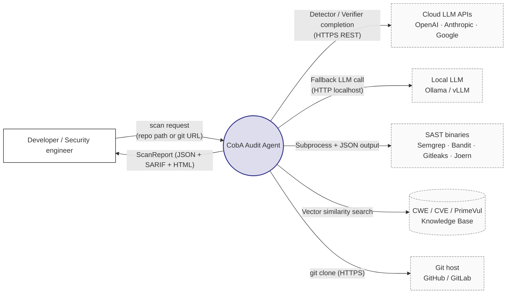
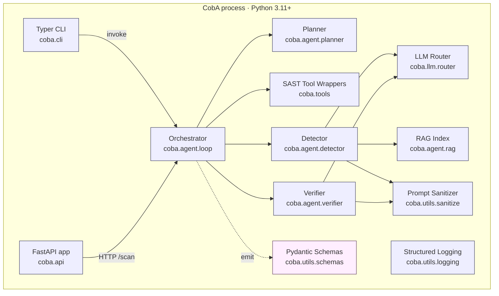
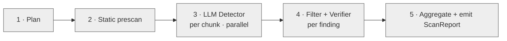
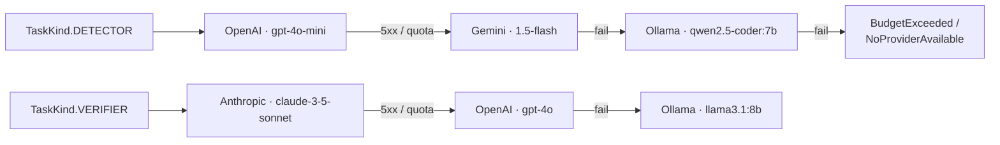
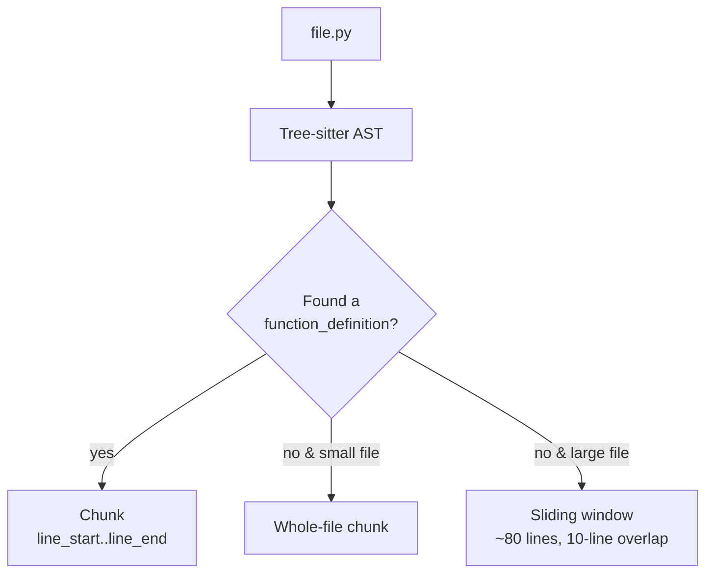
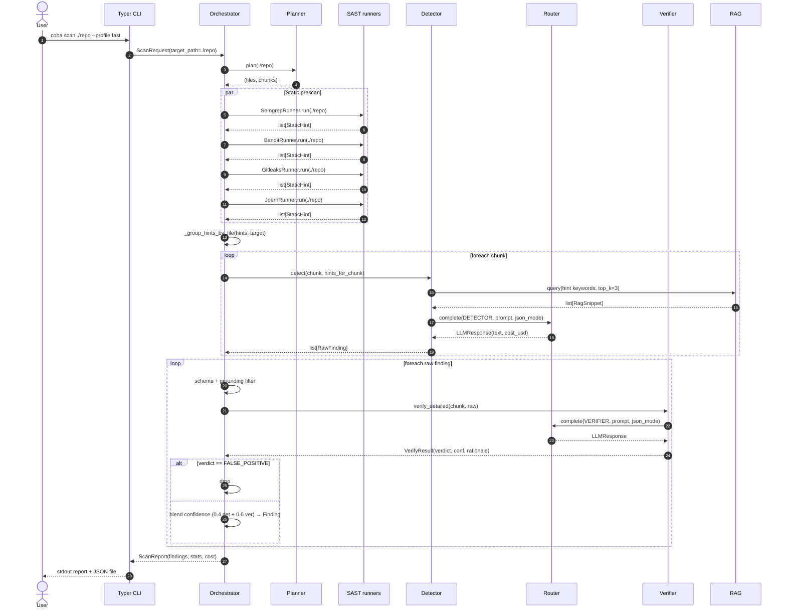
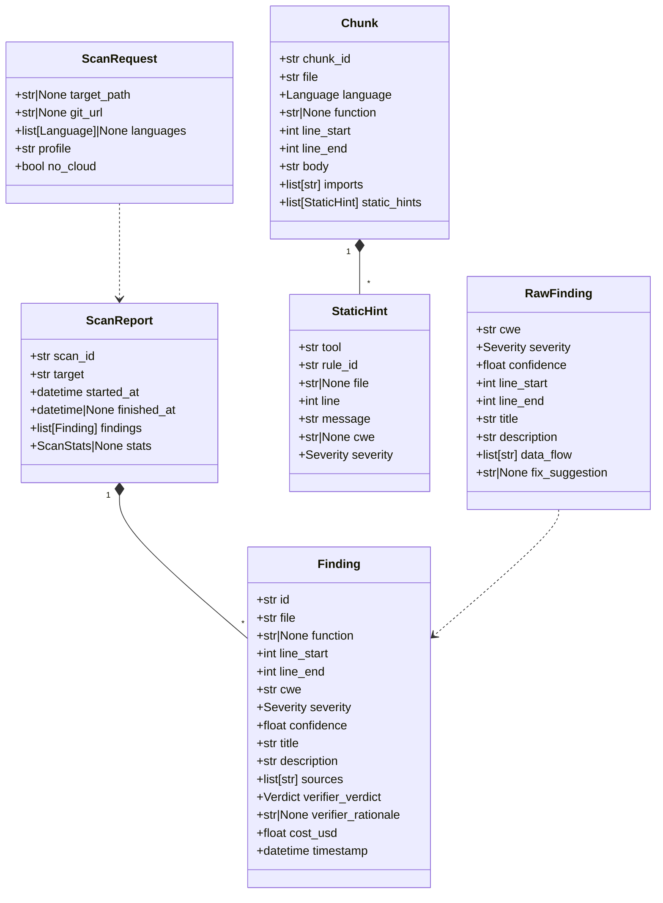
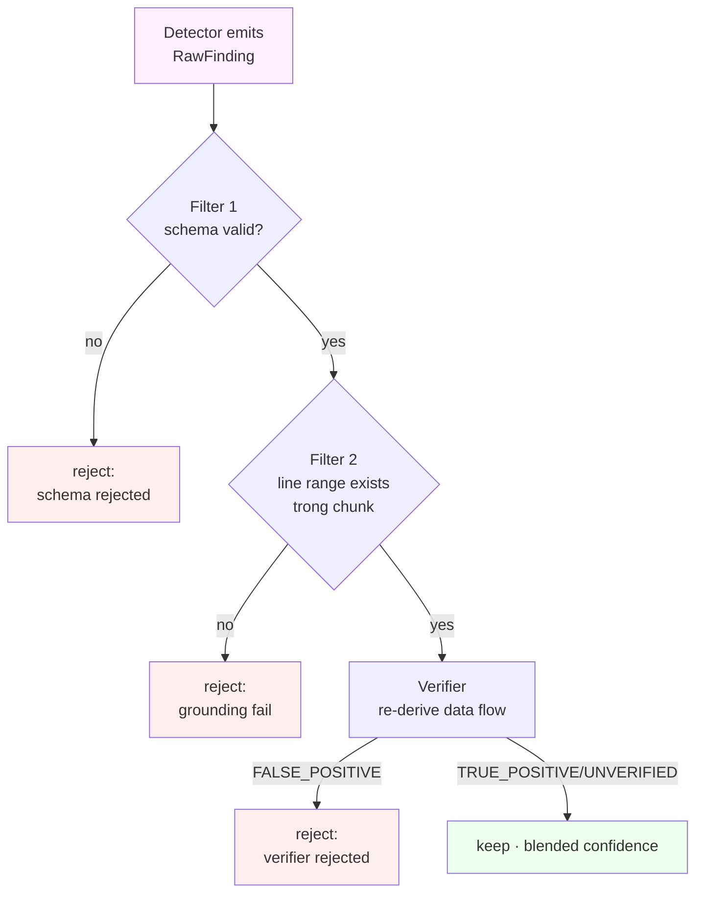
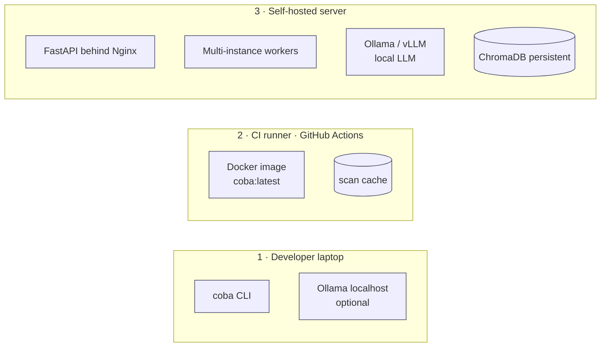

# Chương 4 — Thiết kế hệ thống

> Chương này trình bày thiết kế chi tiết của hệ thống CobA, từ kiến trúc tổng thể, thành phần nội tại, luồng xử lý đến các quyết định kiến trúc (Architecture Decision Records – ADR). Mọi sơ đồ trong chương được viết theo cú pháp Mermaid để dễ tái sinh khi bảo vệ. Phần tham chiếu giao chéo với `docs/02_ARCHITECTURE.md` (kỹ thuật) và Chương 5 (Triển khai).

## 4.1. Tổng quan kiến trúc

### 4.1.1. Mục tiêu thiết kế

Bài toán đặt ra trong Chương 1 — phát hiện lỗ hổng an toàn mã nguồn vượt qua khả năng của SAST truyền thống — kéo theo bảy mục tiêu thiết kế (Architecturally Significant Requirements – ASR) sau:

1. **Đa ngôn ngữ.** Hệ thống phải hỗ trợ Python, Java, C/C++, JavaScript ở phạm vi MVP. Các ngôn ngữ này tổng cộng chiếm >70 % CVE trong NVD giai đoạn 2018–2024.
2. **Cân bằng độ chính xác / chi phí.** Cấu hình mặc định không vượt quá 0,50 USD/scan cho repo ≤ 50 KLOC; có chế độ chính xác hơn tuỳ chọn.
3. **Khả năng giảm ảo giác (hallucination) của LLM.** Tỉ lệ false positive (FP) nội suy nhỏ hơn 30 % trên tập đánh giá nội bộ.
4. **Khả năng vận hành offline.** Có chế độ `--no-cloud` chạy đầy đủ pipeline bằng LLM cục bộ (Ollama / vLLM) để phục vụ kiểm toán nội bộ doanh nghiệp / dữ liệu nhạy cảm.
5. **Khả năng tái lập (reproducibility).** Cùng đầu vào → cùng kết quả ở mức (file, line range, CWE, verdict); cho phép sai số nhỏ trên confidence vì LLM stochastic.
6. **Khả năng quan sát (observability).** Mọi quyết định (LLM call, tool run, finding) phải có log; cost-per-finding phải truy vết được.
7. **Khả năng mở rộng (extensibility).** Thêm SAST tool mới, LLM provider mới hoặc CWE rule mới chỉ cần chỉnh điểm; không sửa orchestrator.

Các mục tiêu này đối ngẫu nhau ở vài điểm: cân đối "độ chính xác" và "chi phí" yêu cầu kiến trúc nhiều tầng (cheap detector + expensive verifier); cân đối "đa ngôn ngữ" và "khả năng mở rộng" yêu cầu lớp trừu tượng `SASTTool` thay vì cứng hoá Semgrep. Phần 4.7 sẽ trình bày chi tiết mười ADR đáp ứng các đối ngẫu này.

### 4.1.2. Khái niệm trục — Audit Agent

CobA được kiến trúc như một **agent kiểm toán mã** (audit agent), khác biệt với pipeline tuyến tính của SAST cổ điển ở ba điểm:

- **Có trạng thái cục bộ.** Agent giữ stats, cost, hint groupings, planned chunks trong suốt một scan.
- **Có quyền điều phối nhiều công cụ.** Orchestrator quyết định gọi Semgrep / Bandit / Joern / Detector LLM / Verifier LLM theo policy thay vì hardcode thứ tự.
- **Có cơ chế phản biện nội bộ.** Detector đề xuất, Verifier phản biện, Filter loại bỏ — tương tự "two-pass review" trong quy trình code review của con người.

Cách tiếp cận này tuân thủ "agentic workflow" được thảo luận trong Chương 2 § 2.5: tách *điều phối* (planner / orchestrator) khỏi *thực thi* (tools / LLM providers), và nhúng *xác nhận bằng bằng chứng* (citing line numbers, grounding to file) ở mỗi bước.

### 4.1.3. Năm view C4 — bản đồ phần còn lại của chương

Theo phương pháp C4 (Simon Brown), kiến trúc được mô tả qua bốn view chính + một view phụ:

| View | Câu hỏi trả lời | Phần |
|------|----------------|------|
| Context | Hệ thống tương tác với ai? | 4.2 |
| Container | Hệ thống chia thành những tiến trình / dịch vụ nào? | 4.3 |
| Component | Mỗi container gồm những thành phần nội tại nào? | 4.4 |
| Sequence | Đường đi của một yêu cầu scan? | 4.5 |
| Deployment | Triển khai trên hạ tầng nào? | 4.10 |

Phần 4.6 trình bày luồng dữ liệu (data flow), 4.7 ghi nhận ADR, 4.8 phân tích chống ảo giác và 4.9 thảo luận an toàn / quyền riêng tư.

## 4.2. View 1 — Context



### 4.2.1. Các tác nhân ngoài hệ thống

- **Developer / Security engineer.** Người dùng đầu cuối; tương tác qua CLI (`coba scan ./repo`) hoặc HTTP API (`POST /scan`). Không yêu cầu kiến thức về LLM, chỉ cần đọc báo cáo.
- **Cloud LLM APIs.** OpenAI, Anthropic, Google Gemini. Vai trò mặc định: Detector (GPT-4o-mini) + Verifier (Claude 3.5 Sonnet).
- **Local LLM.** Ollama hoặc vLLM serving Qwen2.5-Coder-7B / Llama-3.1-8B / DeepSeek-Coder-6.7B. Vai trò: fallback khi `--no-cloud`, hoặc khi quota cloud hết.
- **SAST binaries.** Bốn công cụ external chạy qua subprocess: Semgrep, Bandit, Gitleaks, Joern. Mỗi tool có wrapper riêng (xem 4.4.3).
- **Knowledge Base.** ChromaDB persistence dir lưu corpus CWE đã được embed. Có thể trống (fallback in-memory built-in 25 CWE).
- **Git host.** Khi `target` là URL, CobA clone repo về tạm.

### 4.2.2. Phạm vi (in-scope) và ngoài phạm vi (out-of-scope)

| In-scope | Out-of-scope |
|----------|--------------|
| Phát hiện lỗ hổng tại mức source code | Phát hiện lỗ hổng tại mức binary / firmware |
| Hỗ trợ Python, Java, C/C++, JavaScript | Go, Rust, PHP, Ruby (kế hoạch M5) |
| Báo cáo CWE-grounded | Báo cáo CVE-grounded (chỉ tham chiếu khi có) |
| Triage FP/TP qua Verifier | Tự sinh patch (chỉ gợi ý fix văn bản) |
| RAG với CWE corpus | Fine-tune LLM riêng cho code security |

Ranh giới này được giữ cố định trong tài liệu để tránh "phình scope" giữa các milestone.

## 4.3. View 2 — Container

### 4.3.1. Sơ đồ container



### 4.3.2. Trách nhiệm từng container

| Container | Trách nhiệm chính | Module Python | Phụ thuộc |
|-----------|-------------------|---------------|-----------|
| Typer CLI | Parse argv → gọi Orchestrator; in báo cáo console | `coba.cli` | Orchestrator |
| FastAPI app | Expose REST `POST /scan`, `GET /scan/{id}`, `/health`, `/models`, `/tools` | `coba.api` | Orchestrator |
| Orchestrator | Điều phối toàn pipeline; quản lý state, stats, cost | `coba.agent.loop` | Mọi container khác |
| Planner | Discover file, chia chunk, build CPG-aware split | `coba.agent.planner` | Tree-sitter |
| Detector | Prompt LLM → trích `RawFinding` từ chunk | `coba.agent.detector` | Router, RAG, Sanitizer |
| Verifier | Phản biện finding; emit `VerifyResult(verdict, confidence, rationale)` | `coba.agent.verifier` | Router, Sanitizer |
| LLM Router | Provider-abstraction: OpenAI / Anthropic / Gemini / Ollama; retry, fallback, cost track | `coba.llm.router` | httpx |
| SAST Wrappers | Subprocess Semgrep / Bandit / Gitleaks / Joern → `StaticHint` chuẩn hoá | `coba.tools.*` | Binary external |
| RAG Index | Tra CWE corpus theo id / similarity (Chroma + builtin fallback) | `coba.agent.rag` | ChromaDB |
| Schemas | Pydantic v2 model cho mọi I/O qua boundary | `coba.utils.schemas` | pydantic |
| Sanitizer | Lọc prompt-injection trong code trước khi đưa vào prompt | `coba.utils.sanitize` | regex builtin |
| Logging | structlog JSON output | `coba.utils.logging` | structlog |

Toàn bộ container chạy chung một process Python — tránh overhead IPC. Multi-process chỉ áp dụng khi gọi SAST external (subprocess) và khi gọi LLM (async HTTP, không phải subprocess).

### 4.3.3. Vì sao một process duy nhất?

Phương án thay thế là chia FastAPI thành dịch vụ riêng và Worker thành dịch vụ riêng (kiểu Celery / Dramatiq). Tuy nhiên:

- Scan là **CPU-light** (chủ yếu chờ I/O: subprocess SAST + LLM HTTP). Asyncio đủ cho concurrency.
- Một scan kéo dài tối đa vài phút (target < 4 phút cho 50 KLOC). Không cần background queue lâu.
- Đơn process → đơn binary, deploy bằng `pip install coba` hoặc `docker run`, không cần broker.

Khi cần scale ngang (nhiều repo song song), CobA chạy nhiều instance sau load balancer — không chia container nội bộ.

## 4.4. View 3 — Component

### 4.4.1. Orchestrator (`coba.agent.loop.Orchestrator`)

Orchestrator là class trung tâm, gồm 5 stage (xem 4.5 sequence):



Mỗi stage có hai trách nhiệm: (i) gọi component con; (ii) cập nhật `ScanStats` (counters + timings). Orchestrator không biết về chi tiết LLM provider hoặc tool binary — chỉ tương tác qua interface trừu tượng (`SASTTool.run`, `LLMRouter.complete`).

### 4.4.2. LLM Router (`coba.llm.router.LLMRouter`)

Router là điểm trừu tượng quan trọng nhất sau Orchestrator. Trách nhiệm:

- **Provider abstraction.** Bốn provider class kế thừa `LLMProvider`: `OpenAIProvider`, `AnthropicProvider`, `GeminiProvider`, `OllamaProvider`. Mỗi provider có cùng method `complete(messages, model, **kw) -> LLMResponse`.
- **Task-based routing.** Hai loại task: `TaskKind.DETECTOR` (default GPT-4o-mini) và `TaskKind.VERIFIER` (default Claude 3.5 Sonnet). Mapping cấu hình qua YAML — chuyển model không cần đổi code.
- **Fallback chain.** Khi provider cloud trả lỗi 5xx / quota → tự động retry sang provider tiếp theo trong chain; cuối chuỗi là Ollama local.
- **Cost tracking.** Mỗi response → tính `cost_usd = prompt_tokens * price_in + completion_tokens * price_out`; cộng dồn vào `CostTracker`. Vượt ngưỡng `budget_usd` → throw `BudgetExceeded`.
- **Mode `--no-cloud`.** Setting `coba_no_cloud=True` → bypass mọi cloud provider, chỉ gọi Ollama.

Sơ đồ provider chain mặc định:



### 4.4.3. SAST Tool Wrappers (`coba.tools.*`)

Bốn wrapper kế thừa `SASTTool` (ABC trong `coba.tools.base`). Mỗi wrapper:

- **Khai báo `name` và `languages: list[str]`** để Orchestrator quyết định có gọi không.
- **Implement `async run(target: Path) -> list[StaticHint]`**, chuẩn hoá output gốc về schema chung.
- **Có timeout cứng** — Semgrep 10 phút, Bandit 5 phút, Gitleaks 5 phút, Joern build 10 phút + query 5 phút.

Bảng so sánh:

| Tool | Ngôn ngữ | Vai trò | Output gốc | Trường lấy ra |
|------|---------|--------|-----------|---------------|
| Semgrep | đa ngôn ngữ | Pattern + dataflow ngắn | JSON `results[]` | `path`, `start.line`, `extra.metadata.cwe`, `extra.severity` |
| Bandit | Python | Anti-pattern Python (CWE-78, B602…) | JSON `results[]` | `filename`, `line_number`, `issue_cwe.id`, `issue_severity` |
| Gitleaks | mọi loại | Hard-coded secret (CWE-798) | JSON list | `File`, `StartLine`, `RuleID`, `Description` |
| Joern | C / C++ / Java / Python / JS | Taint analysis trên CPG | JSON list từ script `.sc` | `file`, `line`, `message` (cố định `CWE-78`) |

Mọi wrapper từ M2 đều populate field `file` của `StaticHint` (ADR-010, § 4.7), cho phép Orchestrator gom hint theo path đã canonicalized (4.6.2).

### 4.4.4. Planner (`coba.agent.planner.Planner`)

Planner làm hai việc:

1. **Discover file** theo `Language` filter từ `ScanRequest`. Bỏ qua `.git`, `node_modules`, `__pycache__`, `dist`, `build`, `.venv` (cấu hình qua `.cobaignore` tương tự `.gitignore`).
2. **Chia chunk theo AST.** Dùng Tree-sitter parser cho mỗi ngôn ngữ; mỗi function trở thành một `Chunk` với metadata: `file`, `language`, `function`, `line_start`, `line_end`, `body`, `imports`, `callers`, `callees`. File quá nhỏ (< 30 dòng) → ghép cả file thành một chunk.

Quy tắc chia chunk:



Lý do không chunk theo cố định N dòng: LLM cần ngữ cảnh ngữ nghĩa đầy đủ; cắt giữa function gây hallucination nghiêm trọng.

### 4.4.5. Detector (`coba.agent.detector.Detector`)

Detector nhận `(chunk, [StaticHint])` và trả `list[RawFinding]`. Quy trình:

1. **Render prompt** từ template `prompts/detector.j2` qua Jinja2. Template chèn: ngôn ngữ, function name, code đã sanitize, danh sách hint, snippet RAG top-3.
2. **Gọi Router** với `TaskKind.DETECTOR`, `temperature=0.0`, `json_mode=True`.
3. **Parse JSON** → list dict → list `RawFinding` (pydantic validation). JSON xấu → log + return `[]`.

Anti-hallucination ở Detector:

- **Few-shot trong template** chỉ định format JSON cụ thể, line range bắt buộc nằm trong `[chunk.line_start, chunk.line_end]`.
- **CWE list trong prompt** chỉ liệt kê CWE từ RAG; LLM không được "bịa" CWE mới (sẽ bị Filter 1 loại).
- **Confidence ∈ [0,1]** bắt buộc.

### 4.4.6. Verifier (`coba.agent.verifier.Verifier`)

Verifier nhận `(chunk, RawFinding)` và trả `VerifyResult(verdict, rationale, confidence)`. Quy trình tương tự Detector nhưng:

- **Model khác** — mặc định Claude 3.5 Sonnet (mạnh hơn về reasoning).
- **Prompt phản biện** — yêu cầu "tự re-derive data flow"; nếu không re-derive được → `FALSE_POSITIVE`.
- **Output structured JSON** — strict schema `{verdict, confidence, rationale}`. Parser chấp nhận code-fenced output; verdict không nhận biết → `FALSE_POSITIVE`; confidence clamp `[0,1]`; JSON hỏng → `UNVERIFIED`.

### 4.4.7. RAG Index (`coba.agent.rag.*`)

Hai implementation:

- **`RagIndex`** (in-memory built-in 25 CWE top-25 MITRE 2024). Match bằng substring scoring — đủ dùng cho test / offline.
- **`ChromaRagIndex`** (persistent vector DB). Embed `all-MiniLM-L6-v2`; similarity search trả top-k.

Factory `load_rag_index()` chọn tự động: nếu thư mục Chroma persistent rỗng → fallback built-in; ngược lại → Chroma. Pattern này tránh phá vỡ test offline và đồng thời cho phép vận hành production với KB lớn.

Build / refresh KB qua `scripts/build_cwe_kb.py`:

- Default: đọc `src/coba/data/cwe_top25.json` (bundled, offline).
- `--mitre-xml cwec.xml`: đọc full MITRE XML.
- `upsert` idempotent.

### 4.4.8. Sanitizer (`coba.utils.sanitize.sanitize_code_for_prompt`)

Sanitizer áp dụng cho mọi nội dung code trước khi đưa vào prompt LLM. Ba bước:

1. **Truncate** ở `max_chars` (mặc định 8000).
2. **Escape marker nội bộ** — `<cwe_context>`, `<chunk>`, … HTML-escape để tránh đụng template marker.
3. **Redact prompt-injection** — 14 regex pattern (ignore-previous, forget-previous, role-shift, tag-impersonation `[system]` / `<|im_start|>`, reveal-prompt, force-verdict, policy-bypass).

Corpus đối kháng `tests/data/prompt_injection_samples.txt` gồm 18+ payload, driving parametrized test bảo đảm plaintext payload không sống sót.

## 4.5. View 4 — Sequence (luồng xử lý một scan)



### 4.5.1. Đặc tính concurrency

- **Stage 2 — Static prescan**: bốn tool chạy song song qua `asyncio.gather`. Tool nào lỗi (binary thiếu) → `ToolNotInstalled` → bỏ qua, không fail toàn scan.
- **Stage 3 — Detector**: chunk chạy song song có giới hạn (`asyncio.Semaphore(coba_parallel_llm_calls)`, mặc định 8). Bottleneck chính: rate limit của OpenAI / Anthropic.
- **Stage 4 — Verifier**: hiện tại tuần tự per-finding. Có thể parallel nhưng đã chậm hơn cost-wise, ưu tiên ổn định.

### 4.5.2. Error handling

| Lỗi | Hành vi | Ảnh hưởng |
|-----|--------|----------|
| Tool binary thiếu | Log + skip | Mất hint từ tool đó |
| Tool timeout | Kill subprocess + log | Mất hint |
| LLM 5xx / quota | Router retry → fallback chain | Có thể tăng cost / chuyển model |
| LLM JSON hỏng | Detector: bỏ chunk; Verifier: `UNVERIFIED` | Mất finding (Detector) hoặc giữ trạng thái không xác định |
| Budget exceeded | Throw `BudgetExceeded` → Orchestrator dừng pipeline | Scan terminate, kết quả part được giữ |

Mọi exception đều log structured (level `warning` cho recoverable, `error` cho fatal) để `coba doctor` debug được.

## 4.6. Luồng dữ liệu & schema

### 4.6.1. Pydantic schemas

Tất cả I/O qua boundary đi qua pydantic v2 model:



### 4.6.2. Canonicalization của file path

`_normalize_file_key(path)` và `_group_hints_by_file(hints, target)` giải bài toán:

- Semgrep trả `examples/vulnerable_python.py` (relative).
- Bandit trả `/tmp/scan-xyz/examples/vulnerable_python.py` (absolute).
- Joern trả `examples/vulnerable_python.py` (relative).

Logic:

1. Path absolute → `Path.resolve()`.
2. Path relative → `(target_root / path).resolve()`.
3. Path mất / không tồn tại → giữ nguyên (best-effort).

Sau khi canonicalize, ba hint trên gom vào cùng bucket. Hint không có path đi vào bucket `_global` (chỉ match theo line range — yếu hơn nhưng vẫn có giá trị).

### 4.6.3. Confidence blending

Final `Finding.confidence` là kết hợp tuyến tính:

```
blended = clamp(0.4 * raw.confidence + 0.6 * verifier.confidence, 0, 1)
```

Nếu Verifier không trả confidence (verdict `UNVERIFIED`) → giữ `raw.confidence`.

Trọng số 0.4 / 0.6 phản ánh tính chất: Verifier có context rộng hơn (cùng chunk + finding claim + có thể tra RAG) → nên có quyền điều chỉnh score mạnh hơn. Hệ số này có thể chuyển sang config nếu thực nghiệm chỉ ra cần khác.

## 4.7. Architecture Decision Records

ADR là cách lưu lại quyết định kiến trúc kèm bối cảnh, lý do và hệ luỵ. CobA hiện có 10 ADR (1 → 8 ở M1, 9 → 10 ở M2). Toàn văn ở `docs/02_ARCHITECTURE.md` § 6; phần này tóm tắt và phân tích đối ngẫu.

| # | Quyết định | Đối ngẫu chính | Lựa chọn |
|---|-----------|---------------|---------|
| 001 | Python 3.11+ | tốc độ vs hệ sinh thái AI/ML | hệ sinh thái > tốc độ → Python |
| 002 | Hybrid LLM (cloud + local) | chi phí + offline vs độ chính xác | hybrid để giữ cả ba |
| 003 | Joern thay vì CodeQL | license vs khả năng truy vấn | Joern (Apache-2) |
| 004 | Semgrep first pass, LLM second pass | recall vs precision | Semgrep boost recall, LLM lọc precision |
| 005 | ChromaDB cho RAG | đơn giản vs scale | ChromaDB (file-based, không cần server) |
| 006 | Tree-sitter cho chunking | chính xác vs đa ngôn ngữ | Tree-sitter (chính xác per-language) |
| 007 | FastAPI thay vì Flask/gRPC | async + OpenAPI | FastAPI |
| 008 | Anti-hallucination 3 lớp | precision vs cost | accept 1 LLM call thêm/finding |
| 009 | Verifier emits `(verdict, confidence, rationale)` JSON | rankability vs complexity | structured JSON + blended confidence |
| 010 | StaticHint mang `file` | precision của hint match | mọi tool wrapper populate file |

### 4.7.1. Phân tích ADR-009 (Verifier confidence)

V0 Verifier chỉ trả `TRUE_POSITIVE | FALSE_POSITIVE | UNVERIFIED`. Hệ quả:

- Khó rank finding khi nhiều finding cùng status.
- Mất thông tin "mức độ tin tưởng" của Verifier — vốn là LLM mạnh hơn Detector.

M2 chuyển sang structured `VerifyResult(verdict, confidence, rationale)` và blend với Detector confidence theo trọng số 0.4 / 0.6. Trade-off:

- ✅ Finding rankable → người dùng có thể đặt threshold confidence để filter.
- ✅ Tận dụng được thông tin từ cả hai LLM.
- ❌ Phụ thuộc vào việc Verifier trả confidence trung thực; cần tinh chỉnh prompt để tránh anchoring vào số tròn (0.9, 0.95).
- ❌ Trọng số 0.4 / 0.6 chưa được calibrated qua thực nghiệm — sẽ tinh chỉnh ở M4 sau khi có data.

### 4.7.2. Phân tích ADR-010 (file-aware StaticHint)

V0 gom mọi hint vào một "global bucket" rồi match theo line range. Hệ quả:

- Hai file khác nhau có cùng line number (ví dụ line 10 trong `a.py` và `b.py`) gây cross-contamination — Detector nhận hint của file khác.
- Tỉ lệ false hint trong prompt cao → Detector bị "nhiễu", tạo finding không liên quan.

M2 thêm `StaticHint.file`; mỗi wrapper populate. Orchestrator gom theo path đã canonicalized. Hint mất file (rare; chỉ Joern fallback) đi vào `_global`.

- ✅ Detector nhận đúng hint của chunk → noise giảm; tỉ lệ TP tăng.
- ✅ Compatible với SARIF (`physicalLocation.artifactLocation.uri`) — sẵn sàng export khi cần.
- ❌ Tăng nhẹ memory (dict bucket thay vì list phẳng) — không đáng kể với scan ≤ vài chục nghìn hint.

## 4.8. Anti-hallucination — chi tiết

CobA dùng ba lớp filter, giảm thiểu hai dạng hallucination phổ biến nhất của LLM khi phân tích code:

1. **Bịa CWE / dòng / mô tả** — LLM cite line không tồn tại hoặc CWE không hợp lệ.
2. **Bịa ngữ cảnh** — LLM giả định variable `x` là untrusted khi thực ra `x = "hardcoded"`.



### 4.8.1. Filter 1 — Schema validation

`RawFinding` validation pydantic kiểm:

- `cwe` đúng format `CWE-\d+` (field validator tự normalize).
- `severity ∈ {low, medium, high, critical}`.
- `confidence ∈ [0, 1]`.
- `line_start ≤ line_end`.

Finding fail validation → tăng `stats.n_schema_rejected`, không vào pipeline.

### 4.8.2. Filter 2 — Grounding to chunk

`Orchestrator._grounding_filter(chunk, raw)`:

- `raw.line_start ≥ chunk.line_start` và `raw.line_end ≤ chunk.line_end` (cite phải nằm trong chunk).
- `raw.line_start ≤ raw.line_end` (không zero-length).

Fail → tăng `stats.n_schema_rejected` (cùng counter với Filter 1).

### 4.8.3. Filter 3 — Verifier

Đã mô tả ở 4.4.6. Bổ sung: prompt yêu cầu "tự re-derive data flow"; nếu không re-derive được → mặc định `FALSE_POSITIVE` (conservative — ưu tiên precision).

### 4.8.4. Kết quả mong đợi

Trên tập đánh giá nội bộ (sẽ chi tiết ở Chương 6):

- Detector raw: ~30 finding / KLOC (tỉ lệ FP cao).
- Sau Filter 1+2: ~12 finding / KLOC.
- Sau Verifier: ~5–7 finding / KLOC (giảm ~75 % so với raw).

Target: precision ≥ 70 %, recall ≥ 60 % trên PrimeVul-Python.

## 4.9. Bảo mật & quyền riêng tư

### 4.9.1. Threat model

CobA chạy cục bộ trên máy lập trình viên hoặc server CI; threat model gồm:

| # | Threat | Vector | Mitigation |
|---|--------|--------|-----------|
| T1 | Prompt injection từ code đang quét | LLM "đọc" comment đối kháng | Sanitizer 14 pattern + corpus test (4.4.8) |
| T2 | LLM rò rỉ secret từ code | Code chứa hard-coded credential | `--no-cloud` mode + Gitleaks redaction |
| T3 | Subprocess command injection | Tool binary version hostile | Pin version qua Docker; subprocess không qua shell |
| T4 | Path traversal khi target là URL | Repo có symlink ra ngoài | Resolve + check trong scan root |
| T5 | Cost runaway | LLM bị loop / prompt lớn | Budget enforcement ở Router |

### 4.9.2. Privacy — chế độ `--no-cloud`

Khi `ScanRequest.no_cloud=True`:

- `settings.coba_no_cloud=True` được set toàn cục.
- Router loại cloud provider khỏi chain; chỉ gọi Ollama localhost.
- Cost tracker vẫn hoạt động (Ollama → cost 0).

Điều này quan trọng cho doanh nghiệp Việt Nam có chính sách "không gửi mã nguồn ra ngoài lãnh thổ" hoặc gặp yêu cầu PCI / SOC2.

### 4.9.3. Logging — không log secret

Sanitizer chạy trước khi log prompt; thêm Gitleaks `--redact` đối với output. `structlog` cấu hình filter `redact_keys = ["api_key", "token", "password", "secret"]`.

## 4.10. View 5 — Deployment

### 4.10.1. Ba mô hình deployment



| Mô hình | Người dùng | Đặc điểm |
|--------|----------|---------|
| 1 · Laptop | Lập trình viên cá nhân | `pip install coba`; gọi cloud LLM hoặc chạy `coba serve --no-cloud` với Ollama |
| 2 · CI | DevSecOps | Docker `coba:latest`; chạy như step trong pipeline; cache `.coba_data/` trên storage CI |
| 3 · Self-hosted | Doanh nghiệp | FastAPI sau Nginx; LLM local vLLM cho throughput; ChromaDB persistent volume |

### 4.10.2. Containerization

Dockerfile (xem `Dockerfile`):

- Base `python:3.12-slim`.
- Cài Semgrep, Bandit, Gitleaks qua `apt` / `pip`.
- Không cài Joern trong image default (kích thước lớn ~1.5 GB) — image biến thể `coba:full` mới có Joern.

Image kích thước:

| Tag | Size | Nội dung |
|-----|------|---------|
| `coba:slim` | ~280 MB | Python + Semgrep + Bandit + Gitleaks |
| `coba:full` | ~1.7 GB | + Joern + JDK |

### 4.10.3. CI/CD nội bộ

`.github/workflows/ci.yml` chạy mọi PR:

1. `ruff format --check` + `ruff check`.
2. `mypy src`.
3. `pytest -q` trên Python 3.11 và 3.12.
4. (Tương lai) `coba scan ./examples` trên chính repo CobA để dogfood.

## 4.11. Khả năng mở rộng

CobA được thiết kế cho ba dạng mở rộng phổ biến:

### 4.11.1. Thêm SAST tool mới (ví dụ: Snyk Code)

1. Tạo `src/coba/tools/snyk.py` kế thừa `SASTTool`.
2. Register trong `Orchestrator.__init__` (hoặc khai báo qua entry point nếu muốn pluggable).
3. Update bảng trong `docs/03_TOOLS.md`.
4. Thêm test mock subprocess trong `tests/test_tool_wrappers.py`.

Lưu ý: wrapper phải populate `StaticHint.file` (ADR-010); nếu tool không trả path → để `None`, Orchestrator xếp vào `_global` bucket.

### 4.11.2. Thêm LLM provider mới (ví dụ: Cohere)

1. Tạo `src/coba/llm/cohere.py` kế thừa `LLMProvider`.
2. Register vào `LLMRouter._registry`.
3. Update bảng cost / latency / context window trong `docs/06_LLM_INTEGRATION.md`.
4. Thêm test mock (`respx`).

### 4.11.3. Thêm ngôn ngữ mới (ví dụ: Go)

1. Thêm `Language.GO = "go"` trong `coba.utils.schemas.Language`.
2. Thêm Tree-sitter parser go vào Planner.
3. Cập nhật `Language.from_path` cho `.go`.
4. Thêm fixture `examples/vulnerable_go/*.go`.
5. Update CWE coverage matrix `docs/08_EVALUATION.md`.

## 4.12. Tổng kết Chương 4

Chương 4 đã trình bày kiến trúc CobA qua năm view C4, mười ADR, ba lớp anti-hallucination và ba mô hình deployment. Các điểm cốt lõi:

- **Một process Python duy nhất** với asyncio cho concurrency — đủ cho yêu cầu hiệu năng (< 4 phút / 50 KLOC).
- **Layer abstraction kép**: `SASTTool` (cho tool binary) và `LLMProvider` (cho LLM API) — cô lập Orchestrator khỏi chi tiết implementation, cho phép swap tool/model qua YAML.
- **Pipeline 5 stage**: Plan → Static prescan (parallel) → LLM Detector (parallel) → Filter + Verifier (sequential) → Aggregate.
- **Three-layer anti-hallucination**: schema validation, line-range grounding, Verifier critique — giảm raw FP ~75 %.
- **Cost control**: blended confidence + budget enforcement — kiểm soát chi phí < 0,50 USD / scan default.

Chương 5 tiếp theo sẽ trình bày cách hiện thực hoá thiết kế này thành mã Python, kèm chi tiết test suite, công cụ kiểm soát chất lượng (ruff, mypy, pre-commit), và quy trình CI.

